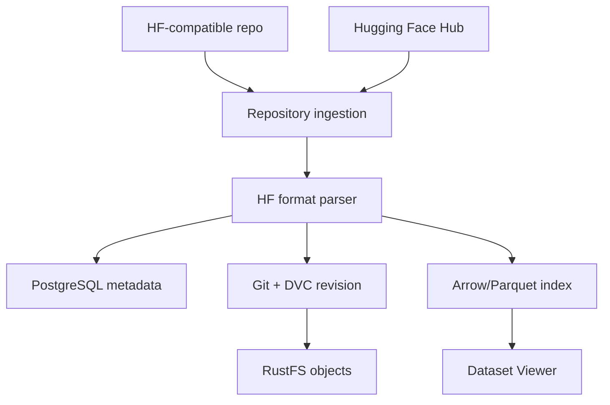

Một nền tảng dữ liệu AI dùng trong production cần nhiều hơn một endpoint upload file. Đặc tả này
xây dựng một quy trình hoàn chỉnh, có thể tái lập, từ repository tương thích Hugging Face đến
revision bất biến, metadata có transaction, lưu trữ content-addressed, index dạng cột và khả năng
phục vụ dữ liệu theo từng revision.

<a class="post-live-demo" href="https://3000--main--frontier--idp-lab.coder.vts-ai.space/" target="_blank" rel="noreferrer"><span>Demo trực tiếp</span> TonAI Data Studio ↗</a>

[Xem tài liệu nguồn trên GitHub](https://github.com/tungedng2710/cognidoc/blob/main/src/data_studio/docs/DOCUMENTATION_vi.md).

| Thuộc tính tài liệu | Giá trị |
| --- | --- |
| Trạng thái | Đặc tả kiến trúc mang tính quy chuẩn |
| Đối tượng sử dụng | Đội ngũ AI Researcher và AI Research Engineer |
| Phạm vi áp dụng | Mọi bản triển khai Data Studio trong môi trường production |
| Trọng tâm | Ingestion repository, revision bất biến, lưu trữ, indexing và phục vụ dataset |

## 1. Phạm vi

Tài liệu này quy định kiến trúc đích và vòng đời dữ liệu bắt buộc của Data Studio. Đây là chuẩn kỹ
thuật dùng cho thiết kế, triển khai, kiểm thử, vận hành và thẩm định hệ thống. Đặc tả không phụ thuộc
vào bất kỳ prototype hoặc kế hoạch phát hành theo giai đoạn nào.

Data Studio PHẢI tiếp nhận repository tuân theo quy ước phổ biến của Hugging Face dataset
repository. Hệ thống PHẢI bảo toàn dữ liệu nguồn, tạo revision bất biến có thể tái lập, duy trì
metadata catalog có transaction, đồng thời cung cấp dữ liệu theo revision qua Dataset Viewer và API
tải dữ liệu.

Đặc tả bao gồm:

- upload repository và import từ Hugging Face Hub;
- validation repository và phân tích layout Hugging Face;
- metadata và quản lý trạng thái trong PostgreSQL;
- tạo revision bằng Git và DVC;
- lưu trữ object trên RustFS;
- tạo Arrow/Parquet index;
- preview, query, download, export, retention và recovery dataset;
- tính nhất quán, bảo mật, khả năng quan sát và tiêu chí nghiệm thu.

Khả năng tương thích hoàn toàn với mọi network endpoint của Hugging Face Hub nằm ngoài phạm vi kiến
trúc này. Tương thích định dạng repository là bắt buộc; mô phỏng giao thức là một phạm vi riêng.

### 1.1 Ngôn ngữ quy chuẩn

Các từ **PHẢI**, **KHÔNG ĐƯỢC**, **NÊN**, **KHÔNG NÊN** và **CÓ THỂ** xác định mức độ yêu cầu:

- **PHẢI/KHÔNG ĐƯỢC**: bắt buộc để được xem là tuân thủ;
- **NÊN/KHÔNG NÊN**: phải được áp dụng, trừ khi có bản ghi quyết định kiến trúc đã phê duyệt và nêu
  rõ lý do ngoại lệ;
- **CÓ THỂ**: tùy chọn, nhưng không được vi phạm yêu cầu bắt buộc.

### 1.2 Thuật ngữ

| Thuật ngữ | Định nghĩa |
| --- | --- |
| Repository | Container dataset có ID nội bộ ổn định và được công bố dưới dạng `{namespace}/{dataset}` |
| Source tree | Toàn bộ file được upload/import cùng đường dẫn tương đối đã chuẩn hóa |
| Revision | Snapshot bất biến đã phát hành của một source tree và layout logic đã phân tích |
| Manifest | Mô tả canonical có checksum của toàn bộ file và layout logic trong một revision |
| Config | Cấu hình hoặc subset có tên của dataset |
| Split | Phân vùng có tên như `train`, `validation` hoặc `test` trong một config |
| Source object | Bản sao bất biến, giống hoàn toàn từng byte của file đầu vào |
| Derived artifact | Kết quả có thể tái tạo như index, schema, statistic hoặc thumbnail |
| Publication barrier | Thao tác nguyên tử cuối cùng làm cho revision hoàn chỉnh trở nên khả dụng với reader |

## 2. Kiến trúc tham chiếu



Luồng tham chiếu:

```text
HF-compatible repository ─┐
                          ├─> Repository ingestion ─> HF format parser
Hugging Face Hub ─────────┘                              │
                                                        ├─> PostgreSQL metadata
                                                        ├─> Git + DVC revision ─> RustFS objects
                                                        └─> Arrow/Parquet index ─> Dataset Viewer
```

Parser tạo ra ba đầu ra được điều phối thống nhất:

1. **Catalog plane** — PostgreSQL lưu định danh repository, chính sách truy cập, trạng thái
   revision, danh sách file, config, split, schema, statistics và trạng thái xử lý.
2. **Version and content plane** — Git lưu lịch sử revision và DVC pointer; DVC cùng RustFS lưu các
   dataset object bền vững, được định danh theo nội dung.
3. **Serving plane** — Arrow/Parquet artifact cung cấp truy cập dạng cột, theo revision cho Dataset
   Viewer.

### 2.1 Các invariant kiến trúc

Mọi bản triển khai tuân thủ PHẢI duy trì các invariant sau:

| ID | Invariant |
| --- | --- |
| ARC-001 | Byte nguồn và đường dẫn tương đối đã chuẩn hóa được bảo toàn, không bị biến đổi. |
| ARC-002 | Revision đã phát hành là bất biến. Mọi thay đổi nội dung hoặc layout tạo revision mới. |
| ARC-003 | Dữ liệu nguồn lớn được lưu trong RustFS, không lưu trong PostgreSQL hoặc Git. |
| ARC-004 | Git chỉ chứa metadata và DVC pointer, không chứa payload dataset lớn. |
| ARC-005 | PostgreSQL không được định danh revision bằng object key có thể thay đổi. |
| ARC-006 | Mọi file trong manifest đã phát hành đều phân giải được tới source object tồn tại và hợp lệ theo checksum. |
| ARC-007 | Mỗi derived artifact chỉ thuộc đúng một source revision bất biến. |
| ARC-008 | Revision không khả dụng với reader thông thường trước khi publication barrier thành công. |
| ARC-009 | Retry cùng request và source tree không tạo revision trùng. |
| ARC-010 | Có thể tái tạo derived artifact mà không sửa source revision. |
| ARC-011 | Code được upload không bao giờ được thực thi khi ingestion, indexing, preview hoặc export. |
| ARC-012 | Credential dài hạn của storage và database không bao giờ được cung cấp cho trình duyệt. |

## 3. Trách nhiệm và giao diện của các thành phần

### 3.1 Source adapter

Hệ thống PHẢI hỗ trợ hai source adapter logic:

- **Upload adapter** dành cho thư mục tương thích Hugging Face do người dùng cung cấp;
- **Hub import adapter** dành cho Hugging Face Hub repository đã được phân giải tới upstream commit
  bất biến.

Cả hai adapter PHẢI tạo cùng một giao diện dữ liệu đầu vào thống nhất:

```text
IngestionInput
├── repository_id
├── source_type: upload | hugging_face_hub
├── source_reference
├── resolved_source_commit (nullable for direct upload)
├── requested_parent_revision
├── commit_message
└── files[]
    ├── relative_path
    ├── staged_location
    └── received_size
```

Khi import từ một upstream reference có thể thay đổi như branch, hệ thống PHẢI phân giải và lưu
upstream commit bất biến trước khi bắt đầu xử lý.

### 3.2 Repository ingestion

Repository ingestion sở hữu hoạt động điều phối và state machine phát hành. Thành phần này PHẢI:

- xác thực và phân quyền request;
- cấp upload/import session và idempotency key;
- stream dữ liệu nguồn vào vùng staging cô lập;
- kiểm tra đường dẫn, giới hạn, signature, encoding và số lượng file khai báo;
- tính checksum nguồn;
- gọi HF format parser;
- điều phối RustFS, DVC, Git, PostgreSQL và indexing;
- thực hiện hoặc bù trừ các bước phát hành một cách an toàn;
- lưu tiến độ, số lần thử và lỗi có cấu trúc.

Ingestion KHÔNG ĐƯỢC làm cho revision trở nên khả dụng bằng cách ghi branch hoặc con trỏ `latest`
trước khi mọi điều kiện phát hành bắt buộc được thỏa mãn.

### 3.3 HF format parser

Parser PHẢI có tính xác định: source tree và phiên bản parser giống nhau PHẢI tạo cùng một layout
logic đã chuẩn hóa.

Parser PHẢI:

1. tìm `README.md` tại thư mục gốc với quy tắc phân biệt hoa thường;
2. decode bằng UTF-8 và cho phép byte-order mark ở đầu file;
3. parse YAML front matter bằng safe loader không có khả năng thực thi;
4. giữ riêng Markdown của Dataset Card và tạo HTML đã sanitize;
5. phân giải `configs`, `config_name`, `data_files`, ánh xạ split tường minh và glob pattern;
6. nhận diện alias split phổ biến và tên file dạng shard khi không có khai báo tường minh;
7. hỗ trợ Parquet, CSV, TSV, JSON, JSONL, TXT, ImageFolder và media reference đã khai báo;
8. tạo config, split, builder type, builder parameter, danh sách file có thứ tự và chẩn đoán;
9. báo lỗi nếu khai báo đường dẫn tường minh không khớp source file nào;
10. không bao giờ import hoặc thực thi Python code trong repository.

Khai báo tường minh trong Dataset Card PHẢI được ưu tiên hơn suy luận. Parser PHẢI ghi mã định danh
schema/phiên bản của parser vào revision manifest.

### 3.4 PostgreSQL metadata catalog

PostgreSQL là nguồn có thẩm quyền đối với trạng thái vận hành, phân quyền và khả năng khám phá dữ
liệu. PostgreSQL chỉ PHẢI lưu metadata và tham chiếu object.

Mô hình logic tối thiểu PHẢI có:

| Entity | Thông tin bắt buộc |
| --- | --- |
| User / principal | ID ổn định, thuộc tính danh tính, tham chiếu xác thực, trạng thái |
| Namespace | ID ổn định, slug, loại owner, chính sách truy cập |
| Dataset repository | ID ổn định, namespace, slug, owner, visibility, default branch, timestamp |
| Dataset revision | Repository, revision cha, revision ID, Git commit, DVC revision, checksum/key manifest, trạng thái, phiên bản parser/index, creator, timestamp, lỗi |
| Repository file | Revision, đường dẫn chuẩn hóa, số byte, SHA-256, media type, source object key, khả năng preview |
| Dataset config | Revision, tên, builder, builder parameter đã chuẩn hóa |
| Dataset split | Config, tên, file có thứ tự, số dòng/byte, tham chiếu schema/index/statistics |
| Upload/import session | Repository, idempotency key, nguồn, số file/byte dự kiến và đã nhận, trạng thái |
| Processing job | Repository, revision, loại, trạng thái, tiến độ, số lần thử, timestamp, lỗi có cấu trúc |
| Branch/reference | Repository, tên, revision sẵn sàng hiện tại, phiên bản cập nhật |

Database constraint PHẢI bảo đảm tên repository duy nhất, revision duy nhất trong repository, đường
dẫn duy nhất trong revision, và tên config/split duy nhất trong phạm vi parent tương ứng.

### 3.5 Dịch vụ Git và DVC revision

Dịch vụ version PHẢI tạo một Git repository nội bộ cho mỗi dataset repository hoặc một namespace
repository có mức cô lập tương đương.

Git PHẢI lưu:

- source Dataset Card nguyên bản, metadata đã parse và bản render đã sanitize được lưu riêng;
- manifest canonical;
- DVC pointer và cấu hình DVC không chứa credential;
- metadata revision, quan hệ revision cha và commit message.

DVC PHẢI track source tree đã materialize hoặc tập nội dung canonical của source tree và PHẢI push
toàn bộ object bắt buộc lên S3-compatible remote trong RustFS trước khi phát hành Git.

Với mỗi revision, dịch vụ PHẢI lưu:

```text
RevisionBinding
├── revision_id
├── manifest_sha256
├── git_commit
├── dvc_revision
├── parent_revision_id
└── source_object_set_checksum
```

Binding này là bất biến. Công cụ kiểm chứng PHẢI chứng minh được Git tree, tập DVC object, manifest
và danh sách file trong PostgreSQL cùng mô tả một revision.
`source_object_set_checksum` PHẢI được tính từ chuỗi tuple `{path, size_bytes, sha256}` đã sắp xếp
theo đường dẫn.

### 3.6 RustFS object storage

RustFS là object store bền vững dành cho:

- source object bất biến;
- DVC remote object/cache;
- manifest canonical;
- Arrow/Parquet index;
- schema, statistics, thumbnail và derived artifact khác;
- revision export tùy chọn;
- staging object tạm thời khi upload trực tiếp vào object storage.

Object PHẢI được ghi bằng credential phía server. Bucket production PHẢI bật mã hóa, versioning hoặc
cơ chế chống ghi đè tương đương, lifecycle policy, access logging, và replication hoặc backup phù
hợp với mục tiêu khôi phục.

### 3.7 Dịch vụ indexing

Indexing chỉ PHẢI chạy trên source object bất biến. Mỗi job PHẢI nhận revision ID, phiên bản parser
và phiên bản định dạng index.

Sử dụng cơ chế xử lý tương thích Arrow, dịch vụ PHẢI:

- materialize từng config/split từ danh sách file có thứ tự do manifest định nghĩa;
- suy luận và lưu schema tường minh;
- tính số dòng chính xác khi định dạng nguồn cho phép;
- tính số byte và statistics cơ bản;
- ghi Parquet partition hoặc Arrow IPC artifact;
- tạo preview có giới hạn và đã sanitize;
- biểu diễn binary và media cell bằng typed reference;
- ghi index manifest có checksum;
- không phát hành index pointer trước khi mọi partition bắt buộc được lưu bền vững.

Quy tắc ép kiểu schema PHẢI có tính xác định và được quản lý phiên bản. Xung đột schema PHẢI làm job
index tương ứng thất bại với chẩn đoán có cấu trúc; hệ thống KHÔNG ĐƯỢC âm thầm loại bỏ hoặc chuyển
đổi dữ liệu.

### 3.8 Dataset Viewer và dịch vụ download

Dataset Viewer PHẢI phân giải repository, revision, config và split qua PostgreSQL trước khi query
index. Kết quả query PHẢI giữ nguyên liên kết với revision đó trong toàn bộ request.

Tầng phục vụ PHẢI hỗ trợ:

- chọn cột;
- phân trang có giới hạn hoặc duyệt bằng cursor;
- lọc có kiểu dữ liệu;
- lấy schema và statistics;
- phân giải media reference;
- tải chính xác file nguồn;
- export toàn bộ revision.

Viewer PHẢI công bố rõ statistics hoặc dòng dữ liệu có dựa trên sample giới hạn hay không. Viewer
KHÔNG ĐƯỢC trình bày kết quả từ sample như kết quả của toàn bộ dataset.

## 4. Mô hình revision và manifest canonical

### 4.1 Quy tắc đường dẫn repository

Đường dẫn repository PHẢI:

- là đường dẫn POSIX tương đối, khác rỗng;
- dùng `/` làm ký tự phân cách;
- không chứa segment `.` hoặc `..`;
- không chứa NUL hoặc ký tự điều khiển;
- không chứa drive prefix, URI scheme hoặc `/` ở đầu;
- luôn phân giải bên trong staging root;
- là duy nhất sau khi chuẩn hóa Unicode và ký tự phân cách.

Symlink, hard-link escape, device file, socket và named pipe PHẢI bị từ chối.

### 4.2 Định danh file

Mỗi source file PHẢI được mô tả bằng:

```json
{
  "path": "data/train-00000-of-00001.parquet",
  "size_bytes": 123456,
  "sha256": "64-lowercase-hex-characters",
  "media_type": "application/vnd.apache.parquet",
  "object_key": "datasets/source/acme/sentiment/<sha256>/data/train-00000-of-00001.parquet"
}
```

SHA-256 PHẢI được tính trên chính xác byte đã nhận. Media type chỉ có tính mô tả và KHÔNG ĐƯỢC thay
thế bước kiểm tra signature hoặc parser.

### 4.3 Manifest canonical

Manifest tối thiểu PHẢI chứa:

```json
{
  "manifest_version": 1,
  "repository_id": "stable-repository-id",
  "repository": "acme/sentiment",
  "parent_revision_id": "nullable-immutable-id",
  "source": {
    "type": "upload",
    "reference": null,
    "resolved_commit": null
  },
  "parser": {
    "name": "hf-format-parser",
    "version": "semantic-version"
  },
  "files": [],
  "configs": []
}
```

Manifest PHẢI dùng JSON UTF-8 có tính xác định, object key được sắp xếp, thứ tự list ổn định và không
có khoảng trắng không mang ý nghĩa. File entry PHẢI được sắp xếp theo đường dẫn chuẩn hóa. Config
PHẢI được sắp xếp theo tên config, split theo tên split và danh sách file của mỗi split theo đường
dẫn chuẩn hóa.

Các giá trị thay đổi theo lần chạy như thời điểm phát hành, job ID, actor ID và attempt number KHÔNG
ĐƯỢC tham gia vào hash của manifest canonical.

### 4.4 Định danh revision

Định danh revision canonical PHẢI là:

```text
revision_id = "sha256:" + SHA256(canonical_manifest_bytes)
```

UI CÓ THỂ dùng dạng rút gọn để hiển thị khi không gây nhập nhằng trong repository. API, quan hệ
database, manifest, branch pointer và audit log PHẢI dùng định danh đầy đủ.

Nếu revision canonical giống hệt đã tồn tại, quá trình phát hành PHẢI trả về revision hiện có. Thay
đổi byte file, đường dẫn file, layout đã phân tích, phiên bản parser hoặc revision cha PHẢI tạo
revision ID khác.

## 5. Giao thức ingestion và phát hành chuẩn

### 5.1 State machine

Các trạng thái xử lý revision chuẩn:

```text
created
  → uploading/importing
  → validating
  → parsing
  → storing
  → versioning
  → indexing
  → publishing
  → ready
```

Mọi trạng thái xử lý CÓ THỂ chuyển sang `failed`. Hủy trước `publishing` CÓ THỂ chuyển sang
`cancelled`. `ready`, `failed` và `cancelled` là trạng thái kết thúc của attempt đó. Retry được ghi
nhận là attempt mới với cùng idempotency key.

### 5.2 Giao thức

#### Giai đoạn 1 — Phân quyền và giữ chỗ

1. Xác thực principal.
2. Phân quyền ghi vào repository đích.
3. Lấy publication lease trong phạm vi repository.
4. Kiểm tra revision cha được yêu cầu với branch head hiện tại.
5. Tạo hoặc khôi phục upload/import session theo idempotency key.

Tại một thời điểm, chỉ một publication CÓ THỂ cập nhật cùng một branch head. Các branch độc lập CÓ
THỂ được xử lý đồng thời.

#### Giai đoạn 2 — Tiếp nhận và staging

1. Stream từng file vào `uploads/staging/{upload-id}/{relative-path}`.
2. Áp giới hạn tổng dung lượng, từng file, số file, tốc độ và temporary storage trong khi stream.
3. Lưu bộ đếm byte/file đã nhận.
4. Chỉ finalize khi tập dữ liệu nguồn đã khai báo đầy đủ.

Staging object PHẢI ở chế độ private và KHÔNG ĐƯỢC phục vụ bởi API đọc dataset.

#### Giai đoạn 3 — Validation và parsing

1. Chuẩn hóa và kiểm tra mọi đường dẫn repository.
2. Đối chiếu staged file với số lượng khai báo.
3. Kiểm tra stable signature và text encoding khi phù hợp.
4. Tính kích thước file, SHA-256 và media type.
5. Parse Dataset Card và layout HF logic.
6. Tạo chẩn đoán validation và manifest canonical dự kiến.

Không được phát hành durable revision record nếu bất kỳ validation bắt buộc nào thất bại.

#### Giai đoạn 4 — Lưu source object

Mỗi file PHẢI được ghi idempotent vào:

```text
datasets/source/{namespace}/{dataset}/{sha256}/{relative-path}
```

Trước khi tái sử dụng key hiện có, storage adapter PHẢI kiểm tra kích thước và checksum. Object xung
đột tại cùng immutable key là sự cố toàn vẹn dữ liệu và PHẢI dừng publication.

#### Giai đoạn 5 — Tạo manifest, DVC revision và Git commit

1. Canonicalize manifest và tính `revision_id`.
2. Trả về revision hiện có nếu ID đã được phát hành.
3. Materialize revision tree từ source object đã kiểm chứng.
4. Tạo DVC pointer và push toàn bộ DVC object được tham chiếu lên RustFS.
5. Xác minh object đã tồn tại trên remote.
6. Commit Dataset Card, manifest và DVC pointer vào Git.
7. Tạo Git ref bất biến cho revision.
8. Lưu `RevisionBinding`.

Git KHÔNG ĐƯỢC tham chiếu tới DVC object chưa được xác nhận là đã lưu bền vững.

#### Giai đoạn 6 — Ghi metadata

Trong một transaction, ghi:

- revision ở trạng thái `indexing`;
- toàn bộ danh sách repository file;
- config và split đã chuẩn hóa;
- binding Git, DVC, manifest và source object;
- indexing job và transactional outbox event.

Transaction PHẢI có tính nguyên tử. Việc dispatch worker PHẢI dùng outbox hoặc cơ chế tương đương để
revision đã commit không thể mất yêu cầu indexing.

#### Giai đoạn 7 — Tạo derived index

Với từng config/split bắt buộc:

1. chỉ đọc source object được manifest tham chiếu;
2. xác minh kích thước/checksum nguồn;
3. tạo schema, số dòng, statistics, preview và partition;
4. ghi artifact dưới derived prefix thuộc revision;
5. ghi và tính checksum cho index manifest;
6. đánh dấu nguyên tử index của config/split đã hoàn tất.

Một revision PHẢI dùng một phiên bản định dạng index thống nhất. Output chưa hoàn chỉnh từ attempt
thất bại KHÔNG ĐƯỢC reader tham chiếu.

#### Giai đoạn 8 — Publication barrier

Trước khi thay đổi branch hoặc con trỏ `latest`, publisher PHẢI kiểm tra:

- checksum manifest và revision ID;
- sự tồn tại và tính toàn vẹn của mọi source object bắt buộc;
- tính đầy đủ của DVC remote;
- Git commit và immutable revision ref;
- tính đầy đủ của file/config/split trong PostgreSQL;
- trạng thái hoàn tất và checksum của mọi index artifact bắt buộc;
- không có yêu cầu hủy hoặc thu hồi quyền làm cản trở publication.

Sau đó publisher PHẢI thực hiện nguyên tử:

1. compare-and-swap branch head dự kiến;
2. chuyển revision sang `ready`;
3. cập nhật branch/con trỏ latest;
4. thêm audit event.

Reader PHẢI chỉ quan sát được ready head trước đó hoặc ready head mới, không được thấy trạng thái
trung gian.

#### Giai đoạn 9 — Hoàn tất

Sau khi phát hành thành công:

- giải phóng publication lease;
- xóa dữ liệu staging theo policy;
- phát revision-ready event;
- giữ lại audit, manifest, Git, DVC, source và derived record.

### 5.3 Idempotency và concurrency

- Mỗi mutation request PHẢI tiếp nhận hoặc tạo idempotency key.
- Idempotency key PHẢI thuộc phạm vi principal, repository, operation và request đã chuẩn hóa.
- Dùng lại key với input khác PHẢI trả về conflict.
- Ghi source object, DVC push, ghi manifest và ghi index PHẢI an toàn khi retry.
- Cập nhật branch PHẢI dùng optimistic concurrency hoặc compare-and-swap tương đương.
- Publication có revision cha cũ PHẢI thất bại tường minh; hệ thống KHÔNG ĐƯỢC tự động rebase hoặc
  ghi đè.

### 5.4 Lỗi và cơ chế bù trừ

| Điểm lỗi | Hành vi bắt buộc |
| --- | --- |
| Upload/validation | Đánh dấu attempt thất bại; trả lỗi có cấu trúc; chỉ giữ staging trong thời gian chẩn đoán giới hạn |
| Ghi source object | Retry an toàn; không phát hành manifest chưa đầy đủ |
| DVC push | Không phát hành Git ref; retry object còn thiếu |
| Git commit/ref | Không đổi branch head; giữ object bền vững cho retry/GC |
| Metadata transaction | Rollback transaction; không dispatch job không được theo dõi |
| Indexing | Giữ revision ở trạng thái chưa ready; retry từ source bất biến |
| Publication compare-and-swap | Đánh dấu conflict; không ghi đè head mới hơn |
| Notification sau publication | Retry gửi event; không revert revision ready hợp lệ |

## 6. Bố cục và quyền sở hữu dữ liệu lưu trữ

Các namespace logic sau mang tính quy chuẩn. Có thể dùng bucket riêng thay cho prefix nếu vẫn duy trì
mức cô lập, policy và ngữ nghĩa đặt tên tương đương.

```text
uploads/
└── staging/{upload-id}/{relative-path}

datasets/
├── source/{namespace}/{dataset}/{sha256}/{relative-path}
├── manifests/{namespace}/{dataset}/{revision-id}/manifest.json
└── derived/{namespace}/{dataset}/{revision-id}/
    ├── index-manifest.json
    ├── indexes/{config}/{split}/part-{partition-id}.parquet
    ├── schemas/{config}/{split}.json
    ├── statistics/{config}/{split}.json
    └── thumbnails/{artifact-id}

dvc/
└── cache/{dvc-managed-object-layout}

exports/
└── {namespace}/{dataset}/{revision-id}/{export-id}/{artifact}
```

### 6.1 Nguồn có thẩm quyền theo loại dữ liệu

| Loại dữ liệu | Biểu diễn có thẩm quyền | Có thể tái tạo |
| --- | --- | --- |
| Chính sách truy cập và trạng thái vận hành | PostgreSQL | Không; phải phục hồi từ database backup/audit log |
| Định nghĩa và quan hệ revision | Manifest canonical + Git revision binding | Không |
| Byte nguồn | RustFS source object + DVC integrity binding | Không |
| Catalog file/config/split | PostgreSQL, có thể kiểm chứng với manifest | Có thể dựng lại, nhưng là nguồn vận hành có thẩm quyền |
| Arrow/Parquet index | RustFS derived artifact + index manifest | Có |
| Preview, schema, statistics, thumbnail | Derived artifact/catalog thuộc revision | Có |
| Staging và export artifact | RustFS temporary namespace | Có |

### 6.2 Quy tắc lưu trữ

- Immutable namespace PHẢI từ chối ghi đè sau khi tạo thành công.
- Mọi object write PHẢI mang hoặc lưu checksum.
- Multipart upload PHẢI hoàn tất hoặc bị abort trong thời gian giới hạn.
- Staging, derived và export PHẢI có retention policy độc lập.
- Object key PHẢI được xem là định danh opaque phía server, không phải URL công khai vĩnh viễn.
- Presigned URL PHẢI có thời hạn ngắn, giới hạn trong một thao tác và chỉ được cấp sau khi phân quyền.
- Đổi tên repository KHÔNG ĐƯỢC viết lại historical revision object; repository ID ổn định PHẢI
  duy trì ownership và khả năng lookup.

## 7. Giao thức query, download và export

### 7.1 Dataset Viewer query

1. Phân giải và phân quyền truy cập repository.
2. Phân giải branch/tag alias thành một revision ID bất biến đầy đủ đúng một lần cho mỗi request.
3. Phân giải config/split và index manifest hoàn chỉnh trong PostgreSQL.
4. Kiểm tra revision của index và khả năng tương thích phiên bản định dạng.
5. Chỉ query Arrow/Parquet partition thuộc revision.
6. Áp giới hạn dòng, byte, thời gian thực thi và kích thước kết quả.
7. Trả revision ID đã phân giải trong mọi response.

Paging token PHẢI encode hoặc liên kết revision ID. Token của revision này KHÔNG ĐƯỢC chấp nhận cho
revision khác.

### 7.2 Tải file gốc

Dịch vụ PHẢI phân giải `{repository, revision_id, relative_path}` thành đúng một file entry trong
manifest, phân quyền người gọi và stream source object tương ứng. Response metadata NÊN có kích
thước, media type, ETag/checksum và định danh revision bất biến.

CÓ THỂ hỗ trợ range request và presigned download thời hạn ngắn. Phân quyền PHẢI diễn ra trước khi
cấp URL, và private object key KHÔNG ĐƯỢC cho phép liệt kê.

### 7.3 Export revision

Một bản export PHẢI:

- liên kết với một revision ID bất biến đầy đủ;
- đọc file theo thứ tự đường dẫn trong manifest;
- bảo toàn đường dẫn tương đối và byte nguồn;
- bao gồm Dataset Card và manifest;
- loại derived artifact trừ khi được yêu cầu tường minh;
- tạo và công bố checksum của export;
- hết hạn theo export retention policy.

## 8. Vòng đời, xóa và khôi phục thảm họa

### 8.1 Vòng đời revision

Revision ở trạng thái ready KHÔNG ĐƯỢC sửa đổi. Re-indexing tạo generation derived artifact mới được
liên kết với cùng revision và phiên bản định dạng index mới; thao tác này không tạo source revision.

### 8.2 Xóa dữ liệu

Xóa repository hoặc revision PHẢI là quy trình hai giai đoạn:

1. tạo tombstone và xóa user-visible reference theo phân quyền và retention policy;
2. chỉ xóa vật lý object không còn được tham chiếu sau recovery window và một lần quét tham chiếu đầy
   đủ.

Garbage collection PHẢI dùng mark-and-sweep trên PostgreSQL, Git ref, manifest, DVC metadata, active
job, legal hold và retained export. Chỉ dựa trên tuổi của prefix KHÔNG ĐỦ để kết luận immutable object
không còn được tham chiếu.

### 8.3 Backup và recovery

Backup PHẢI bao phủ PostgreSQL, Git repository nội bộ, RustFS source/manifest/DVC object và encryption
key bắt buộc. Chỉ CÓ THỂ loại derived index khỏi backup khi thời gian rebuild đáp ứng recovery
objective.

Thứ tự recovery PHẢI là:

1. phục hồi dữ liệu identity/access và PostgreSQL;
2. phục hồi Git và manifest canonical;
3. phục hồi RustFS source và DVC object;
4. kiểm tra revision binding và checksum;
5. tái tạo derived index còn thiếu;
6. bật read traffic;
7. bật write/publication traffic.

Kiểm thử recovery PHẢI xác minh ít nhất một revision hoàn chỉnh từ catalog lookup đến download giống
hoàn toàn từng byte và Viewer query hợp lệ.

## 9. Yêu cầu bảo mật

- Mọi nội dung repository PHẢI được xem là dữ liệu không đáng tin cậy.
- Python hoặc executable content được upload chỉ PHẢI lưu như byte opaque và KHÔNG ĐƯỢC thực thi.
- Giải nén archive PHẢI từ chối traversal, đường dẫn tuyệt đối, link, device file và dung lượng giải
  nén vượt giới hạn.
- Khai báo MIME KHÔNG ĐƯỢC tin cậy nếu không có signature/parser validation phù hợp.
- Dataset Card YAML PHẢI dùng safe loader; Markdown sau khi render PHẢI được sanitize.
- Ingestion và indexing worker PHẢI chạy với quyền tối thiểu và có giới hạn CPU, memory, thời gian và
  temporary storage.
- Service identity NÊN dùng credential tách biệt cho PostgreSQL, source storage, DVC, Git và derived
  storage khi khả thi.
- PHẢI bật mã hóa khi truyền và khi lưu.
- Log KHÔNG ĐƯỢC chứa credential, access token, presigned URL hoặc raw dataset row nhạy cảm.
- PHẢI phân quyền cho metadata, index, source object, export và trạng thái job.
- Audit record PHẢI bao phủ mutation nhạy cảm về xác thực, thay đổi access policy của repository,
  publication, deletion, cấp token và thao tác recovery quản trị.

## 10. Yêu cầu quan sát và vận hành

Mỗi ingestion attempt PHẢI có correlation ID, upload/import ID, repository ID, job ID và revision ID
sau khi canonicalize.

Bản triển khai PHẢI cung cấp:

- counter và duration histogram cho state transition;
- số byte và object ở staging/source/derived;
- lỗi checksum và lỗi toàn vẹn;
- độ trễ DVC push và Git publication;
- throughput indexing, số partition và tỷ lệ lỗi;
- độ trễ publication barrier và số compare-and-swap conflict;
- độ trễ Viewer, số dòng/byte đã scan và số request bị từ chối do giới hạn;
- staging leak, orphan candidate và kết quả garbage collection.

Alert PHẢI phân biệt lỗi availability, lỗi toàn vẹn dữ liệu, lỗi phân quyền, cạn tài nguyên và lỗi
validation dự kiến từ người dùng. Lỗi toàn vẹn dữ liệu PHẢI có mức độ vận hành cao nhất.

## 11. Tiêu chí tuân thủ và nghiệm thu

Bản triển khai chỉ được xem là tuân thủ đặc tả khi automated test chứng minh:

1. upload/import và download giống hoàn toàn từng byte với mọi định dạng nguồn được hỗ trợ;
2. bảo toàn đường dẫn tương đối lồng nhau và từ chối đường dẫn không an toàn;
3. parsing và tạo manifest có tính xác định;
4. revision identity có tính xác định và retry idempotent;
5. phân giải đúng config, split, shard và Dataset Card;
6. DVC remote đầy đủ trước khi Git publication;
7. revision chưa index hoặc commit hoàn chỉnh không thể được nhìn thấy;
8. compare-and-swap bảo vệ cập nhật branch đồng thời;
9. phát hiện checksum sai của source, manifest và index object;
10. Viewer query và phân trang được cô lập theo revision;
11. tái tạo được toàn bộ derived artifact từ source object bất biến;
12. phân quyền đầy đủ cho metadata, Viewer, download, export và mutation;
13. thất bại và recovery an toàn tại mọi giai đoạn publication;
14. phục hồi backup, sau đó download giống hoàn toàn từng byte và Viewer query hợp lệ;
15. garbage collection bảo toàn mọi revision và shared content object còn được tham chiếu.

Các yêu cầu trên định nghĩa kiến trúc chuẩn của Data Studio. Mọi sai khác phải có quyết định kiến
trúc được thẩm định và PHẢI bảo toàn toàn bộ invariant kiến trúc tại Mục 2.1.

## 12. Ví dụ sử dụng dành cho AI Researcher

Phần này có tính tham khảo, minh họa trải nghiệm mong đợi của một AI Researcher. Các yêu cầu kiến
trúc và toàn vẹn dữ liệu mang tính quy chuẩn trong những phần trước vẫn là nguồn có thẩm quyền.

### 12.1 Dataset nghiên cứu tham khảo

Các ví dụ sử dụng dataset nhận dạng bảng có tên `table-html-reasoning-v2`. Dataset ghép ảnh bảng đã
render với HTML nguồn và nhãn suy luận cấu trúc logic được tạo theo quy trình có tính xác định.

Workspace nguồn có cấu trúc:

```text
table-html-reasoning-v2/
├── README.md
├── metadata.json
├── hf_parquet/
│   ├── train-00000-of-00006.parquet
│   ├── train-00001-of-00006.parquet
│   ├── ...
│   ├── train-00005-of-00006.parquet
│   └── test-00000-of-00001.parquet
├── images/
│   └── 31.490 ảnh bảng PNG
├── table_html/
│   └── 31.490 nhãn HTML
└── table_html_reasoning/
    └── 31.490 nhãn reasoning JSON
```

Dataset sau khi phát hành có split dự kiến:

| Split | Số mẫu | Mục đích |
| --- | ---: | --- |
| `train` | 28.341 | Huấn luyện và phát triển mô hình |
| `test` | 3.149 | Đánh giá độc lập |
| **Tổng** | **31.490** | |

Mỗi dòng được phát hành chứa:

| Cột | Ý nghĩa |
| --- | --- |
| `id` | Định danh mẫu ổn định |
| `images` | Một hoặc nhiều ảnh bảng đã render |
| `table_html` | HTML nguồn của bảng |
| `reasoning` | Nhãn suy luận cấu trúc logic được encode dưới dạng JSON |
| `num_rows`, `num_cols`, `num_cells` | Kích thước cấu trúc |
| `has_merged_cells` | Bảng có sử dụng `rowspan` hoặc `colspan` hay không |
| `validation_passed` | Kết quả validation cấu trúc có tính xác định |
| `num_images` | Số ảnh liên kết với mẫu |

### 12.2 Chuẩn bị repository để phát hành

Researcher NÊN đặt Dataset Card tại thư mục gốc được upload và khai báo tường minh các Parquet shard.
Khai báo tường minh giúp việc phân giải config/split có tính xác định và không phụ thuộc vào heuristic
tên file.

Ví dụ YAML front matter trong `README.md`:

```yaml
---
license: other
task_categories:
  - image-to-text
  - visual-question-answering
language:
  - en
size_categories:
  - 10K<n<100K
pretty_name: Table HTML with Logical Reasoning
configs:
  - config_name: default
    data_files:
      - split: train
        path: hf_parquet/train-*.parquet
      - split: test
        path: hf_parquet/test-*.parquet
---
```

Dataset Card cũng NÊN mô tả:

- mục đích của dataset và tác vụ mô hình dự kiến;
- nguồn dữ liệu và thông tin license;
- cách tạo split và cơ chế kiểm soát rò rỉ dữ liệu;
- định nghĩa các cột;
- phiên bản schema của reasoning label;
- validation failure và giới hạn đã biết;
- quy trình sinh nhãn.

Trước khi upload, researcher NÊN kiểm tra:

1. mọi đường dẫn tương đối dùng `/` và phân giải bên trong repository root;
2. mọi Parquet shard có thể mở thành công;
3. image hoặc auxiliary-file reference phân giải được tới file trong repository;
4. sample ID ổn định và duy nhất;
5. số lượng split bằng 28.341 dòng train và 3.149 dòng test;
6. không có credential, đường dẫn tuyệt đối cục bộ, file tạm hoặc cache được sinh tự động.

### 12.3 Phát hành dataset qua ứng dụng web

1. Mở [TonAI Data Studio](https://3000--main--frontier--idp-lab.coder.vts-ai.space/) và đăng nhập.
2. Chọn **New dataset**.
3. Sử dụng thông tin repository, ví dụ:

   ```text
   Namespace: research
   Dataset: table-html-reasoning-v2
   Visibility: Internal
   Description: Table images, HTML, and deterministic logical-structure reasoning labels
   ```

4. Mở repository và chọn **Upload revision**.
5. Chọn thư mục `table-html-reasoning-v2/`. Thư mục gốc được chọn PHẢI chứa `README.md`.
6. Nhập commit message có ý nghĩa, ví dụ:

   ```text
   Publish v2 with deterministic train/test split and logical reasoning labels
   ```

7. Bắt đầu phát hành và giữ upload session hoạt động cho đến khi toàn bộ source file được tiếp nhận.
8. Chờ revision chuyển sang trạng thái `ready`.
9. Ghi lại revision ID đầy đủ do Data Studio hiển thị.

Researcher NÊN thấy revision đã phát hành có:

- config `default`;
- split `train` và `test`;
- số dòng tương ứng là 28.341 và 3.149;
- Dataset Card, cây file repository, schema, statistics, preview và lịch sử revision.

Sai lệch số lượng split, thiếu shard, không phân giải được ảnh hoặc pattern `data_files` tường minh
không hợp lệ PHẢI làm publication thất bại, không được chấp nhận như một dataset chưa đầy đủ.

### 12.4 Kiểm tra revision đã phát hành

Researcher NÊN thực hiện các kiểm tra sau trước khi dùng revision trong thí nghiệm:

#### Dataset Card và revision

- xác nhận title, task, language, license, nguồn và giới hạn;
- xác nhận revision ID và publication message được hiển thị;
- kiểm tra cây file có đủ bảy Parquet shard và auxiliary asset bắt buộc.

#### Schema và số lượng split

- mở config `default`;
- so sánh số dòng `train` và `test` với giá trị dự kiến;
- kiểm tra cột cấu trúc sử dụng kiểu numeric/boolean;
- kiểm tra sự tồn tại của `images`, `table_html` và `reasoning`.

#### Kiểm tra trực quan và cấu trúc

- mở các dòng đại diện và so sánh ảnh đã render với `table_html`;
- lọc `has_merged_cells = true` để kiểm tra ví dụ có `rowspan`/`colspan`;
- lọc `validation_passed = false` để audit các bất thường nguồn được bảo toàn;
- kiểm tra mẫu từ từng nhóm nguồn thay vì chỉ trang đầu tiên;
- tải ít nhất một source object và xác minh checksum khi thực hiện release audit.

Trường `reasoning` là một chuỗi JSON. Record sau khi decode được kỳ vọng có `schema_version`,
`table_shape`, `cells`, `logical_grid`, `relations`, `reasoning_trace` và `validation`. Một vùng chứa
nhiều top-level table CÓ THỂ decode thành danh sách reasoning record.

### 12.5 Sử dụng revision cố định trong thí nghiệm

Thí nghiệm PHẢI ghi revision ID đầy đủ của Data Studio thay vì alias có thể thay đổi như `main` hoặc
`latest`. Thí nghiệm cũng NÊN ghi checksum của manifest và export.

Ví dụ cấu hình thí nghiệm:

```yaml
dataset:
  repository: research/table-html-reasoning-v2
  revision: sha256:<full-canonical-revision-hash>
  config: default
  train_split: train
  evaluation_split: test
  manifest_sha256: <manifest-checksum>
  export_sha256: <optional-export-checksum>
```

Sau khi tải và giải nén toàn bộ revision export vào `./table-html-reasoning-v2`, có thể đọc các
Parquet file mà không thực thi code trong repository:

```python
import json

from datasets import load_dataset

data_files = {
    "train": "./table-html-reasoning-v2/hf_parquet/train-*.parquet",
    "test": "./table-html-reasoning-v2/hf_parquet/test-*.parquet",
}
dataset = load_dataset("parquet", data_files=data_files)

assert dataset["train"].num_rows == 28_341
assert dataset["test"].num_rows == 3_149

sample = dataset["train"][0]
decoded = json.loads(sample["reasoning"])
reasoning_records = decoded if isinstance(decoded, list) else [decoded]

print(sample["id"])
print(reasoning_records[0]["table_shape"])
print(reasoning_records[0]["logical_grid"][0])
```

Experiment record NÊN lưu thêm training code commit, model configuration, random seed và Data Studio
revision ID. Đây là liên kết tối thiểu cần thiết để tái lập chính xác byte dataset đã được sử dụng.

### 12.6 Phát hành revision tiếp theo

Khi label, HTML, ảnh hoặc cách chia split thay đổi, researcher PHẢI phát hành một child revision thay
vì thay thế revision đang ở trạng thái ready.

Quy trình khuyến nghị:

1. bắt đầu từ đúng parent revision được dùng để chuẩn bị thay đổi;
2. cập nhật source file và Dataset Card;
3. mô tả thay đổi schema hoặc quy trình sinh dữ liệu trong commit message;
4. upload toàn bộ cây repository;
5. xác minh parent revision dự kiến trước khi publication;
6. lặp lại kiểm tra Card, schema, số lượng split, trực quan và validation;
7. ghi revision ID đầy đủ mới vào cấu hình của các thí nghiệm tiếp theo.

Các thí nghiệm đã hoàn thành trước đó vẫn được pin vào revision cũ. Nhờ đó, kết quả mô hình có thể
được so sánh trực tiếp mà không nhập nhằng về nội dung dataset.
