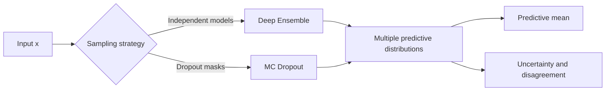

# Why uncertainty matters

A neural network can be confidently wrong. A softmax score of `0.99` only says that one logit is much larger than the others; it does not prove that the input resembles the training data or that the prediction is reliable.

This distinction matters whenever a prediction drives a decision. A medical model should flag an unfamiliar scan, a perception system should recognize when weather has moved beyond its training distribution, and a forecasting model should widen its interval when evidence is scarce. In these settings, returning only a point prediction hides information the downstream system needs.

The goal of **uncertainty estimation** is to make a model answer two questions:

1. What is the prediction?
2. How much should we trust it?

Exact Bayesian inference in modern neural networks is usually impractical. This article introduces two accessible approximations:

- **Deep Ensembles** train several independently initialized networks and measure their agreement.
- **Monte Carlo Dropout (MC Dropout)** keeps dropout active at inference and samples multiple predictions from one network.

Both methods convert repeated predictions into a predictive distribution, but they make different trade-offs in compute, memory, and uncertainty quality.

## Predictive uncertainty in one equation

For input $x$, parameters $\theta$, and training data $\mathcal{D}$, a Bayesian predictive distribution averages predictions over plausible model parameters:

$$
p(y \mid x, \mathcal{D})
=
\int p(y \mid x, \theta)\,p(\theta \mid \mathcal{D})\,d\theta.
$$

A conventional neural network replaces the posterior $p(\theta \mid \mathcal{D})$ with one fitted parameter vector $\hat{\theta}$. Deep Ensembles and MC Dropout instead produce a finite set of predictions that approximates this average:

$$
p(y \mid x, \mathcal{D})
\approx
\frac{1}{S}\sum_{s=1}^{S} p(y \mid x, \theta_s).
$$

The samples $\theta_s$ come from independent training runs for a deep ensemble and from different dropout masks for MC Dropout.



# Aleatoric and epistemic uncertainty

It is useful to separate two sources of uncertainty.

## Aleatoric uncertainty: ambiguity in the data

**Aleatoric uncertainty** is noise inherent in the observation process. Examples include sensor noise, an occluded object, overlapping classes, or genuinely stochastic outcomes. Collecting more data of the same quality does not remove this ambiguity.

In regression, a model can learn input-dependent aleatoric uncertainty by predicting both a mean $\mu_\theta(x)$ and variance $\sigma_\theta^2(x)$. Under a Gaussian likelihood, the per-example negative log-likelihood is, up to a constant,

$$
\mathcal{L}(x,y)
=
\frac{1}{2}\log \sigma_\theta^2(x)
+
\frac{\left(y-\mu_\theta(x)\right)^2}{2\sigma_\theta^2(x)}.
$$

The model learns a larger variance where targets are noisy, but the logarithmic term prevents it from inflating variance without cost.

## Epistemic uncertainty: uncertainty about the model

**Epistemic uncertainty** comes from limited knowledge: sparse training data, multiple parameter settings that explain the observations, or an input far from the training distribution. In principle, this uncertainty can shrink as representative data is added.

Deep Ensembles and MC Dropout mainly help expose epistemic uncertainty through disagreement. If repeated predictions differ substantially, the model should not be represented by a single confident output.

The separation is useful but not perfect. The quality of both estimates depends on the model, objective, data, and sampling approximation. An uncertainty score is not automatically calibrated just because it has a probabilistic interpretation.

# Method 1: Deep Ensembles

A deep ensemble trains $M$ networks with the same architecture and dataset but different random initializations and mini-batch orders. Each optimization run reaches a different solution. Their predictions form an empirical mixture.

The procedure is simple:

1. Initialize $M$ models independently.
2. Train every model with a proper scoring rule such as cross-entropy or negative log-likelihood.
3. Run all models at inference.
4. Average their predictive distributions and measure disagreement.

The original Deep Ensembles work showed that this straightforward approach produces strong predictive uncertainty and behaves sensibly under dataset shift without requiring a full Bayesian neural network.

## Classification with an ensemble

Let model $m$ produce class probabilities $p_m(y=c \mid x)$. The ensemble prediction is

$$
\bar{p}_c(x)=\frac{1}{M}\sum_{m=1}^{M}p_m(y=c \mid x).
$$

Do not average logits and then apply softmax: average the **probabilities** because the ensemble represents a mixture of categorical distributions.

A useful total-uncertainty score is predictive entropy:

$$
H[\bar{p}]
=
-\sum_c \bar{p}_c \log \bar{p}_c.
$$

We can also compare the entropy of the mean prediction with the mean entropy of individual predictions:

$$
U_{\text{disagreement}}
=
H[\bar{p}]
-
\frac{1}{M}\sum_{m=1}^{M}H[p_m].
$$

The first term is high when the combined prediction is uncertain. The difference becomes high when ensemble members disagree, making it a useful proxy for epistemic uncertainty.

```python
import torch


def entropy(probabilities, eps=1e-8):
    probabilities = probabilities.clamp_min(eps)
    return -(probabilities * probabilities.log()).sum(dim=-1)


@torch.inference_mode()
def ensemble_classification(models, inputs):
    probabilities = torch.stack([
        model(inputs).softmax(dim=-1)
        for model in models
    ])  # [models, batch, classes]

    mean_probability = probabilities.mean(dim=0)
    predictive_entropy = entropy(mean_probability)
    expected_entropy = entropy(probabilities).mean(dim=0)
    disagreement = predictive_entropy - expected_entropy

    return mean_probability, predictive_entropy, disagreement
```

Every model should be in evaluation mode before this function is called so that BatchNorm and Dropout behave deterministically within each ensemble member.

## Regression with an ensemble

Suppose every network predicts a Gaussian distribution with mean $\mu_m(x)$ and variance $\sigma_m^2(x)$. The ensemble mean is

$$
\bar{\mu}(x)=\frac{1}{M}\sum_{m=1}^{M}\mu_m(x).
$$

The variance of the Gaussian mixture can be decomposed as

$$
\underbrace{\frac{1}{M}\sum_{m=1}^{M}\sigma_m^2(x)}_{\text{aleatoric}}
+
\underbrace{\frac{1}{M}\sum_{m=1}^{M}\left(\mu_m(x)-\bar{\mu}(x)\right)^2}_{\text{epistemic}}.
$$

This equation is especially practical: the predicted variance within each model represents data noise, while variation among model means represents model disagreement.

## Strengths and limitations

Deep Ensembles are often a strong default because they are easy to reason about, parallelize naturally, and usually provide better uncertainty than a single network. They can also improve average predictive performance.

The cost is substantial. An ensemble of five models requires roughly five training runs, five parameter sets, and five forward passes. Training jobs can run in parallel, but inference memory and latency remain concerns. Members may also learn similar functions despite different seeds, so an ensemble does not guarantee meaningful diversity or reliable out-of-distribution detection.

# Method 2: Monte Carlo Dropout

Dropout randomly removes activations during training. Ordinarily it is disabled at inference. **MC Dropout** keeps dropout active, samples $T$ masks, and treats the resulting predictions as draws from an approximate posterior predictive distribution.

The method follows three steps:

1. Train a model with dropout as usual.
2. At inference, keep dropout layers stochastic.
3. Repeat the forward pass $T$ times and aggregate the predictions.

Gal and Ghahramani connected this procedure to approximate Bayesian inference in deep Gaussian processes. Operationally, its appeal is that an existing dropout model can produce an uncertainty estimate without training several independent networks.

## A safe PyTorch implementation

Calling `model.train()` at inference activates dropout, but it also updates BatchNorm statistics. That can silently change the model. A safer pattern is to put the entire model in evaluation mode and then enable only dropout modules:

```python
import torch
from torch import nn


DROPOUT_TYPES = (
    nn.Dropout,
    nn.Dropout1d,
    nn.Dropout2d,
    nn.Dropout3d,
    nn.AlphaDropout,
)


def enable_dropout(module):
    if isinstance(module, DROPOUT_TYPES):
        module.train()


@torch.inference_mode()
def mc_dropout_classification(model, inputs, samples=30):
    model.eval()
    model.apply(enable_dropout)

    probabilities = torch.stack([
        model(inputs).softmax(dim=-1)
        for _ in range(samples)
    ])  # [samples, batch, classes]

    mean_probability = probabilities.mean(dim=0)
    predictive_entropy = entropy(mean_probability)
    expected_entropy = entropy(probabilities).mean(dim=0)
    disagreement = predictive_entropy - expected_entropy

    return mean_probability, predictive_entropy, disagreement
```

The same aggregation used for ensemble classification applies here. The only difference is the source of predictive samples.

For regression, collect $T$ predicted means. Their sample variance estimates epistemic uncertainty. If the model also predicts an observation variance, average those variances and add the variance of the sampled means to estimate total predictive variance.

## How many stochastic passes?

There is no universal value for $T$. Start with 20–30 passes, then check whether the mean prediction and uncertainty ranking stabilize as more samples are added. A latency-sensitive service may use fewer passes; an offline safety analysis may use 50 or more.

The dropout rate is not merely an inference setting. It shapes training and the approximate posterior, so changing it only after training is not principled. Tune it using validation negative log-likelihood or another uncertainty-aware metric, not accuracy alone.

## Strengths and limitations

MC Dropout stores one set of weights and requires only one training run. It is therefore attractive when retraining several models is too expensive.

Inference is still repeated, so latency grows with $T$. Its samples share the same learned weights and may be less diverse than independently trained networks. Results are also sensitive to where dropout appears and which rate is used. A network trained without dropout cannot gain a principled MC Dropout posterior merely by inserting random masks at inference.

# Deep Ensembles or MC Dropout?

| Consideration | Deep Ensembles | MC Dropout |
| --- | --- | --- |
| Training cost | $M$ independent training runs | One training run |
| Stored parameters | $M$ model checkpoints | One checkpoint |
| Inference cost | $M$ forward passes | $T$ stochastic forward passes |
| Source of diversity | Initialization and optimization paths | Dropout masks |
| Architecture changes | None required | Dropout must be trained into the model |
| Parallelism | Excellent across models | Excellent across stochastic samples |
| Typical uncertainty quality | Often a strong practical baseline | Useful but more architecture-sensitive |

Choose **Deep Ensembles** when uncertainty quality is important and you can afford several models. Choose **MC Dropout** when training and storage budgets are constrained or the deployed model already uses dropout. For high-stakes systems, evaluate both on the failures and shifts that matter rather than choosing from the table alone.

A hybrid is also possible: train a small ensemble and draw several dropout samples from each member. This increases diversity but multiplies inference cost, so it should be justified by measured gains.

# Evaluating uncertainty

Accuracy does not tell us whether uncertainty is useful. Evaluate both the predictive distribution and its behavior under stress.

## Proper scoring rules

- **Negative log-likelihood (NLL)** rewards probabilities assigned to the observed outcome and heavily penalizes confident mistakes.
- **Brier score** measures the squared distance between predicted class probabilities and the one-hot target.

Both consider the complete probability vector instead of only the winning class.

## Calibration

A calibrated classifier should be correct about 80% of the time among predictions made with 80% confidence. Reliability diagrams reveal where confidence and empirical accuracy diverge. Expected Calibration Error (ECE) summarizes binned gaps, but the value depends on binning and should not be reported alone.

Calibration can change after deployment. Temperature scaling on an in-distribution validation set may improve confidence calibration, but it does not guarantee reliable uncertainty under a new distribution.

## Selective prediction

Sort predictions by uncertainty and abstain on the most uncertain cases. A useful estimator should improve accuracy or reduce loss as coverage decreases. Plotting risk against coverage often reveals more operational value than a single calibration number.

## Distribution shift and out-of-distribution data

Test realistic shifts: different sensors, locations, seasons, populations, corruptions, or class mixtures. Measure whether uncertainty rises before performance collapses. Neither method is a universal out-of-distribution detector; neural networks can remain confident on inputs far from the training data.

# A practical workflow

1. **Start with the decision.** Define what happens when uncertainty is high: abstain, request a human review, gather another measurement, or fall back to a safer model.
2. **Choose a probabilistic output.** Use categorical probabilities for classification and an appropriate likelihood for regression.
3. **Build a deterministic baseline.** Record accuracy, NLL, Brier score, calibration, and latency.
4. **Add an uncertainty method.** Try a small ensemble such as $M=5$, or MC Dropout with $T=20$–$30$.
5. **Calibrate on held-out data.** Never fit a calibration transform on the test set.
6. **Evaluate relevant shifts.** Synthetic noise is useful, but domain-specific shifts are more informative.
7. **Measure the system trade-off.** Report quality together with training cost, memory, inference latency, and coverage at the chosen risk threshold.
8. **Monitor after deployment.** Track confidence distributions, abstention rates, drift, and delayed outcomes when labels become available.

# Final perspective

Uncertainty estimation does not make a model trustworthy by itself. It creates a signal that can support safer decisions, better monitoring, and more informative data collection.

Deep Ensembles provide a robust and conceptually simple baseline when compute allows multiple models. MC Dropout provides a cheaper entry point when one dropout-trained model must do the job. In both cases, the essential practice is the same: generate multiple plausible predictions, aggregate them carefully, and validate whether disagreement actually identifies errors in the environment where the model will operate.

## References

1. [Lakshminarayanan, Pritzel, and Blundell, “Simple and Scalable Predictive Uncertainty Estimation using Deep Ensembles,” NeurIPS 2017](https://papers.neurips.cc/paper_files/paper/2017/hash/9ef2ed4b7fd2c810847ffa5fa85bce38-Abstract.html)
2. [Gal and Ghahramani, “Dropout as a Bayesian Approximation: Representing Model Uncertainty in Deep Learning,” ICML 2016](https://proceedings.mlr.press/v48/gal16.html)
3. [Kendall and Gal, “What Uncertainties Do We Need in Bayesian Deep Learning for Computer Vision?” NeurIPS 2017](https://papers.neurips.cc/paper_files/paper/2017/hash/2650d6089a6d640c5e85b2b88265dc2b-Abstract.html)
