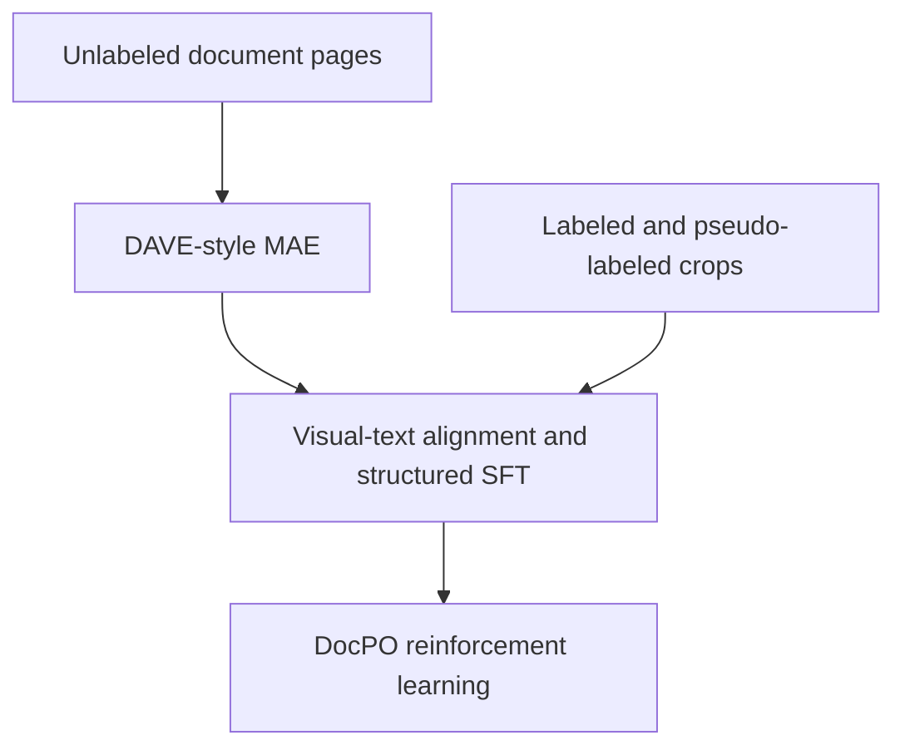

# Executive summary

DAVE, MonkeyOCRv2, and DocPO address different stages of a document vision-language model (VLM) lifecycle rather than competing as three interchangeable training recipes.

| Method | Primary stage | Main contribution | Best use case |
|---|---|---|---|
| DAVE | Vision-encoder pretraining and multi-decoder alignment | Domain-specific MAE, supervised structural pretraining, generalist feature fusion, and decoder-agnostic weight merging | Large quantities of unlabeled document pages; reusable encoder for parsing, VQA, grounding, and web/UI tasks |
| MonkeyOCRv2 | Visual-text encoder pretraining and downstream VLM construction | Joint text generation and pixel/stroke reconstruction on large multilingual page and element data | High-fidelity OCR, formulas, tables, multilingual documents, and reducing dependence on language priors |
| DocPO | RL post-training after SFT | Element-specific rewards and Step-Aware Annealing for GRPO | Improving an already accurate document parser, especially on hard text, table, and formula cases |

The methods fit naturally into the following lifecycle:



MonkeyOCRv2 provides an alternative or additional bridge between the first two steps: it jointly teaches visual fidelity and text generation before the encoder is connected to the final LLM. DocPO belongs at the end; it is neither an encoder pretraining method nor a substitute for alignment and SFT.

# 1. Scope and terminology

A conventional document VLM contains:

```text
document image -> vision encoder -> projector/connector -> language model -> structured output
```

This survey distinguishes four training phases:

1. **Visual self-supervised pretraining:** learn document structure from images without text labels.
2. **Visual-text pretraining/alignment:** make visual tokens usable by an autoregressive decoder.
3. **Supervised fine-tuning (SFT):** learn task instructions and output formats such as Markdown, HTML, LaTeX, JSON, bounding boxes, and reading order.
4. **Reinforcement learning with verifiable rewards (RLVR):** optimize sequence-level accuracy beyond teacher-forced SFT.

DAVE emphasizes phases 1 and 2. MonkeyOCRv2 combines visual reconstruction and autoregressive textual supervision before using the encoder in downstream systems. DocPO specializes phase 4.

# 2. DAVE

**Paper:** [DAVE: A VLM Vision Encoder for Document Understanding and Web Agents](https://arxiv.org/abs/2512.17221)

## 2.1 Motivation

General-purpose encoders such as SigLIP or DINO are largely trained on natural images. Their high-level semantic features are useful, but they are not optimized for the fine spatial structure of documents, charts, web pages, and user interfaces. DAVE therefore builds a specialist encoder while retaining access to a generalist encoder's semantic representation.

The paper also identifies a practical compatibility problem: an encoder trained with one language decoder can become tightly coupled to that decoder and transfer poorly to another. DAVE explicitly trains with several decoder families and merges the resulting encoders.

## 2.2 Stage 1: self-supervised document MAE

DAVE first trains a ViT-L/16 encoder from scratch using Masked Autoencoding. With masked patch set $\mathcal M$, it reconstructs the raw pixel values of the hidden patches:

$$
\mathcal L_{\text{MAE-pixel}}
=
\frac{1}{|\mathcal M|}
\sum_{i\in\mathcal M}
\left\|f_\theta(\tilde x)_i-x_i\right\|_2^2.
$$

This differs from the original MAE objective, which normalizes pixels inside every patch before calculating the loss. DAVE reports that per-patch normalization becomes unstable on document and web images because many neighboring patches have low visual variance. Direct raw-pixel reconstruction stabilizes training.

Key Stage-1 settings reported in the paper are:

| Item | Setting |
|---|---:|
| Encoder | ViT-L/16 at 384 resolution |
| Initialization | From scratch |
| Training images | 20M |
| Documents | 10M DocFM images |
| Web screenshots | 10M Common Screen images |
| Mask ratio | 75% |
| Batch size | 4,096 |
| Training | 25 epochs / approximately 120K steps |
| Hardware | 32 H200 GPUs |

After this stage, the lightweight MAE decoder is discarded and the encoder is retained.

## 2.3 Stage 2: supervised autoregressive pretraining

The MAE encoder is inserted into a VLM:

```text
DAVE encoder -> MLP projector -> pretrained text decoder
```

The model is trained autoregressively on OCR, layout extraction, document grounding, chart/table extraction, LaTeX generation, HTML table generation, and web-UI grounding. The listed datasets contain roughly 2.08M images in total, including FM4D, PlotQA, FinTabNet, ChartQA, DaTikZ, PubTables, UGround, and a self-curated grounding/structure dataset.

The authors train encoder instances with three different LLMs:

- Qwen2.5-0.5B-Instruct
- Phi-4-mini-Instruct
- Granite-3.1-3B-Instruct

Supervised pretraining uses a maximum sequence length of 20K, learning rate $3\times10^{-5}$, one epoch, and AnyRes-style 384-pixel tiling.

## 2.4 Generalist feature ensemble

DAVE concatenates features from two encoders:

$$
\phi_{\text{DAVE}}(x)
=
\operatorname{Concat}
\left(
\phi_{\text{gen}}(x),
\phi_{\text{spec}}(x)
\right),
$$

where the generalist branch is a frozen SigLIP2 encoder and the specialist branch is the document/web MAE encoder. This lets the specialist focus on low-level spatial structure without sacrificing the general visual semantics already represented by SigLIP2.

The trade-off is that the final visual front end depends on an external generalist encoder and produces more visual features than a single-encoder design.

## 2.5 Multi-decoder weight merging

If $\phi_1,\ldots,\phi_n$ are encoder instances aligned with different text decoders, DAVE constructs merged weights:

$$
\theta_{\text{merge}}^{(j)}
=
\sum_{i=1}^{n}
\alpha_i^{(j)}\theta_i^{(j)}.
$$

The original encoder parameters remain frozen while the merge coefficients are learned through feature distillation. This produces an encoder intended to be less dependent on any single LLM family.

This part is valuable when the vision encoder must later be tested with several LLMs. It is less valuable when the production model has one fixed decoder and training multiple full encoder–decoder combinations is too expensive.

## 2.6 Evidence, strengths, and limitations

The paper reports that DAVE improves the average performance over SigLIP2 by 10.5% across its document/web evaluation and improves Mind2Web agent performance by about 5% over the strongest encoder baseline. Its most convincing contribution is the demonstration that domain-specific unlabeled pretraining produces visual representations that transfer beyond pure OCR.

Strengths:

- Exploits very large unlabeled document collections.
- Learns layout and spatial priors without OCR labels.
- Covers document, chart, UI grounding, and web-agent tasks.
- Explicitly addresses compatibility with different language decoders.
- Retains general semantics through feature fusion.

Limitations:

- Fixed-resolution encoder with image tiling rather than native dynamic resolution.
- Large ViT-L training requires substantial compute.
- Dependence on an external SigLIP2 branch complicates deployment.
- Multi-decoder training and merging increase experimental cost.
- The MAE representation still requires supervised visual-language training before it is useful in a VLM.

# 3. MonkeyOCRv2

**Paper:** [MonkeyOCRv2: A Visual-Text Foundation Model for Document AI](https://arxiv.org/abs/2607.11562)

## 3.1 Motivation

MonkeyOCRv2 argues that document encoders must preserve character-level evidence. In natural-image recognition, small variations in texture or local appearance are often irrelevant. In documents, a decimal point, stroke, superscript, or table border can change the meaning completely.

Autoregressive text-only pretraining is also insufficient: a decoder can exploit language context to guess visually unclear characters. MonkeyOCRv2 combines text generation with image reconstruction so that visual tokens retain both semantic content and the underlying glyph evidence.

## 3.2 Data engine

MonkeyDoc v2 contains 113M samples across 17 languages, including Vietnamese:

| Subset | Scale |
|---|---:|
| Full pages | 8M |
| Cropped document elements | 105M |
| Real samples | 61M (54%) |
| Synthetic samples | 52M (46%) |
| Formula samples | Approximately 0.8M |

The strong emphasis on element crops gives dense supervision for text, formulas, and tables. Real documents are labeled with a multi-expert agreement pipeline: several specialist recognizers predict each crop, and the prediction with the highest average agreement is retained.

Synthetic data are generated by rendering multilingual corpora, rare Unicode characters, random character sequences, formulas, and multilingual table content into varied fonts and layouts. Two notable filtering rules are used:

- Mask all detected regions; reject the page if a document VLM can still read residual text, indicating missed layout regions.
- Concatenate content in annotated reading order and use an LLM to reject inconsistent or incorrectly ordered pages.

## 3.3 Dual-objective encoder pretraining

The pretraining system contains a vision encoder $E_v$, vision decoder $D_v$, and autoregressive text decoder $D_t$:

$$
\mathbf z=E_v(I), \qquad \hat I=D_v(\mathbf z).
$$

The default reconstruction loss is full-image pixel MSE:

$$
\mathcal L_{\text{pix}}
=
\frac{1}{3HW}\left\|\hat I-I\right\|_2^2.
$$

The text decoder consumes the same visual tokens and predicts OCR or structured text using cross-entropy. The joint objective is:

$$
\mathcal L_{\text{pretrain}}
=
\mathcal L_{\text{text}}
+
\lambda\mathcal L_{\text{rec}}.
$$

The paper sets $\lambda=1$. Unlike DAVE's masked-patch reconstruction, MonkeyOCRv2 describes full-image reconstruction from the encoded tokens.

The authors also evaluate a stroke-aware variant:

$$
\mathcal L_{\text{rec}}
=
\mathcal L_{\text{pix}}
+
\alpha\mathcal L_{\text{struct}},
$$

where $\mathcal L_{\text{struct}}$ compares Sobel-derived edge maps and differentiable distance-to-edge maps. The reported coefficients are $\alpha=0.5$, $\beta=0.25$, and $\lambda=1$. Most experiments use MSE-only reconstruction; the stronger edge-aware variant is evaluated in the controlled document-understanding experiment.

## 3.4 Encoder family and training

| Variant | Backbone | Parameters | Intended role |
|---|---|---:|---|
| MonkeyOCRv2-S | ViT-Small | 28M | Recognition and compact VLMs |
| MonkeyOCRv2-B | ViT-Base | 113M | Parsing and document understanding |
| MonkeyOCRv2-AS | ViTAEv2-Small | 21M | Detection, segmentation, and multi-scale localization |

The encoders are trained from scratch on 64 A800 GPUs with a peak learning rate of $10^{-3}$, global batch size 256, dynamic resolution, and approximately one-million-pixel input budget for the ViT variants.

After pretraining, both the vision decoder and the temporary text decoder are discarded. Only the vision encoder is transferred.

## 3.5 Downstream VLM construction

For document parsing, the retained encoder is connected through an MLP projector to Qwen3-0.6B:

```text
MonkeyOCRv2-S/B -> MLP projector -> Qwen3-0.6B
```

The encoder remains frozen throughout:

1. Train only the projector for alignment at learning rate $2\times10^{-4}$.
2. Train the projector and Qwen3-0.6B jointly at learning rate $2\times10^{-5}$.

The parsing system first generates layout categories, bounding boxes, and reading order from the page. It then crops each predicted element and applies the same VLM again with an element-specific prompt. The outputs are assembled into the final document representation.

For document-understanding experiments, the paper instead pairs frozen encoders with Qwen3-1.7B through an MLP projector.

## 3.6 Evidence, strengths, and limitations

The most important ablation is the controlled comparison where the downstream LLM, data, training, and decoding remain fixed. The average document-understanding score increases from 50.7 with text-generation-only pretraining to 51.7 with MSE reconstruction and 55.9 with edge/distance-aware reconstruction for the Small encoder. The Base edge-aware model reaches 57.2.

In the scrambled-text experiment at resolution 448, reconstruction improves accuracy from 55.4% to 72.1% and reduces the coherent-versus-scrambled accuracy gap from 29.3% to 15.3%. This supports, but does not fully prove, the claim that reconstruction reduces dependence on language priors.

MonkeyOCRv2-B-Parsing reports 83.3 on multilingual MDPBench versus 80.5 for dots.mocr. On OmniDocBench 1.6 it reaches 91.57 with the encoder frozen and without progressive post-training, but remains below the strongest specialized parsers. The authors appropriately warn that full-system comparisons are not controlled because systems differ in data, layout models, post-processing, and post-training.

Strengths:

- Strong character-level visual grounding.
- Explicit multilingual and rare-character supervision.
- Encoder remains useful for recognition, detection, segmentation, parsing, and VQA.
- Dynamic-resolution training and compact encoder sizes.
- Controlled evidence that reconstruction improves document VLM performance.

Limitations:

- Requires large quantities of labeled, pseudo-labeled, or synthetic data.
- 113M-sample pretraining is expensive to reproduce.
- English and Chinese remain dominant despite 17-language coverage.
- Pretraining decoder designs and loss schedules are not fully isolated.
- Crop-then-recognize inference improves fidelity but adds latency.
- Page-level structure receives far fewer samples than element-level recognition.

# 4. DocPO

**Paper:** [DocPO: Advancing Document Policy Optimization via Tailored Step-Aware Rewards](https://arxiv.org/abs/2608.00536)

## 4.1 Motivation

DocPO starts from an already SFT-trained document VLM. It addresses two problems in applying GRPO to document parsing:

1. Plain string edit distance is unsuitable for heterogeneous document elements.
2. When the model is already accurate, multiple rollout answers receive very similar high scores, yielding weak within-group advantages.

DocPO keeps the Qwen2.5-VL architecture unchanged and operates entirely at the reward and optimization level.

## 4.2 Element-specific base rewards

All base rewards are normalized to $[0,1]$.

For text, DocPO uses character-level normalized edit similarity:

$$
R_{\text{text}}
=
1-
\frac{\operatorname{EditDist}(y,y^*)}
{\max(|y|,|y^*|)}.
$$

For tables, it uses weighted TEDS/APTED over the HTML tree:

$$
R_{\text{table}}
=
1-
\frac{\operatorname{TreeEditDist}_{w}(y,y^*)}
{\max(|y|,|y^*|)}.
$$

Structural node insertion/deletion and span errors receive cost 2, while content mismatches receive cost 1. This penalizes a broken `rowspan` or `colspan` more strongly than a character typo.

For formulas, it combines syntax validity, semantic equivalence, and edit similarity:

$$
R_{\text{formula}}
=
v_{\text{syn}}
\left(
0.8r_{\text{sem}}+0.2r_{\text{struct}}
\right).
$$

Malformed LaTeX receives zero through $v_{\text{syn}}$. Semantic equivalence is judged zero-shot by Qwen2.5-7B-Instruct, while the structural component is normalized edit similarity.

## 4.3 Step-Aware Annealing

DocPO's central contribution is a power-law transformation of the base reward $M$:

$$
R_{\text{shaped}}=M^\gamma.
$$

The exponent grows during training:

$$
\gamma(s)
=
\gamma_{\text{init}}
+
\Delta_\gamma
\left[
1-\exp\left(-\frac{s}{\tau_{\text{adaptive}}}\right)
\right],
$$

with $\gamma_{\text{init}}=1$ and $\Delta_\gamma=8$. Early training therefore sees almost unchanged rewards. Later training increasingly separates high-quality candidates while compressing weak candidates toward zero.

For example:

| Base score | $\gamma=1$ | $\gamma=8$ |
|---:|---:|---:|
| 0.90 | 0.900 | 0.430 |
| 0.95 | 0.950 | 0.663 |
| Gap | 0.050 | 0.233 |

Because the transformation is monotonic, it preserves ranking. Its purpose is to make small differences among near-correct rollouts more discriminative after GRPO group normalization.

A Dynamic Dispersion Controller computes the rolling coefficient of variation separately for text, table, and formula rewards. It changes the annealing time constant so that the sharpening rate adapts to recent task-specific reward dispersion.

## 4.4 Training recipe

The paper uses:

| Item | Setting |
|---|---:|
| Base model | Qwen2.5-VL-3B; scaling test on 7B |
| Initial SFT data | 490K full-page samples |
| RL data | 612K element patches |
| RL tables | 206K |
| RL formulas | 196K |
| RL text blocks | 210K |
| Rollouts per example | 8 |
| RL learning rate | $10^{-6}$ |
| Global RL batch size | 128 |
| Input/output limits | 4K / 8K |
| KL constraint | None |

Before RL, the authors remove examples for which all eight rollouts are perfect and examples for which all eight receive zero. Both groups have no useful reward variance for GRPO. Training focuses on examples where the current policy sometimes succeeds and sometimes fails.

## 4.5 Evidence, strengths, and limitations

| Element | SFT baseline | Intermediate RL | Final DocPO |
|---|---:|---:|---:|
| Text NED ↓ | 0.0358 | 0.0238 with edit reward | **0.0125** |
| Formula CDM ↑ | 92.61 | 93.93 with Rubric+edit | **94.70** |
| Table TEDS ↑ | 89.30 | 91.70 with APTED | **93.01** |

Dynamic SAA outperforms fixed exponents in the table ablation. It also reaches a table TEDS threshold of 91 in 587 steps versus 1,070 without SAA, approximately 1.8 times faster according to the paper.

Strengths:

- No modification of the vision encoder or VLM architecture.
- Interpretable rewards aligned with each element's native structure.
- Focuses compute on informative hard cases.
- Improves a strong model in the high-accuracy regime.
- Does not require a separately trained reward model for text and tables.

Limitations:

- Primarily element-level RL; it does not directly optimize full-page coverage or reading order.
- Formula rewards require an external LLM semantic judge.
- Training rewards are closely related to evaluation metrics, so downstream reasoning gains are not established.
- Removing the KL constraint may increase specialization and forgetting risk.
- RL is unlikely to help when all sampled answers are uniformly incorrect.
- The self-constructed DocElemHard benchmark requires independent external validation.

# 5. Direct comparison

| Dimension | DAVE | MonkeyOCRv2 | DocPO |
|---|---|---|---|
| Model component improved | Vision encoder | Vision encoder | Full VLM policy |
| Starting point | Randomly initialized ViT | Randomly initialized compact encoder | SFT document VLM |
| Primary supervision | Unlabeled images, then structured labels | Paired visual-text data plus reconstruction | Reference outputs and verifiable rewards |
| Main objective | Masked raw-pixel reconstruction, then autoregressive multitask learning | Text cross-entropy plus full-image/stroke reconstruction | GRPO with task-specific shaped rewards |
| Document scale | 20M pages/screens in SSL; ~2.08M supervised images | 113M samples, mostly element crops | 490K SFT pages and 612K RL crops |
| Resolution | Fixed base resolution plus tiling | Dynamic resolution | Inherited from Qwen2.5-VL |
| LLM relationship | Trains with multiple LLMs and merges encoders | Temporary decoder discarded; downstream Qwen3-0.6B/1.7B | Directly post-trains Qwen2.5-VL |
| Key advantage | Efficient use of unlabeled data and structural learning | Fine visual fidelity and reduced language shortcuts | Fine-grained improvement after SFT saturation |
| Main cost | Large MAE and multi-decoder training | Massive labeled/pseudo-labeled corpus | Multiple rollouts and reward computation |
| Best evaluation level | Encoder transfer and VLM tasks | Encoder transfer, parsing, and understanding | Element parsing after SFT |

## 5.1 DAVE versus MonkeyOCRv2

These methods share the goal of building a document-native encoder, but their supervision differs:

- DAVE first learns from unlabeled full pages using masked reconstruction, then adds supervised parsing and grounding.
- MonkeyOCRv2 jointly learns textual output and full visual reconstruction on paired page/element data.

DAVE is preferable when unlabeled page scale is the main asset. MonkeyOCRv2 is preferable when reliable OCR, table, formula, and synthetic labels can be generated at scale and character fidelity is the dominant requirement.

They can be combined, but the hybrid is an inference from the two papers rather than a recipe validated by either paper:

```text
DAVE-style MAE initialization
-> MonkeyOCRv2-style text generation + reconstruction continuation
-> final LLM alignment and structured SFT
```

## 5.2 Encoder pretraining versus DocPO

DocPO is complementary to both encoder methods. Better vision features reduce perceptual errors; DocPO improves how the complete autoregressive model chooses and structures its outputs. DocPO cannot recover visual details that the encoder discarded, and encoder pretraining alone cannot optimize sequence-level TEDS, LaTeX validity, or output formatting.

# 6. Recommended recipe for the current project

Assumed current assets:

- Approximately 20M document pages.
- A document MAE encoder already trained on about 2.6M images.
- Approximately 100K annotated images for visual-language alignment.
- One DGX node with 8 H200 GPUs.
- A target document VLM/decoder such as Chandra 2.

The most practical strategy is not to restart all three papers literally.

## Stage A — preserve the existing MAE checkpoint

Treat the current encoder as the DAVE Stage-1 result. Before additional training, evaluate it with frozen linear or lightweight heads on:

- OCR character recognition
- Layout element classification/localization
- Reading-order prediction
- Table-region recognition
- Document VQA with a controlled projector and LLM

Compare against the original general-purpose encoder under identical downstream training.

## Stage B — add MonkeyOCRv2-style visual-text continuation

Create a mixture of full pages and fine-grained crops from the 100K verified annotations and pseudo-labeled portion of the remaining corpus. Continue training the MAE encoder with:

$$
\mathcal L
=
\mathcal L_{\text{text}}
+
\lambda_{\text{pix}}\mathcal L_{\text{pix}}
+
\lambda_{\text{stroke}}\mathcal L_{\text{struct}}.
$$

Recommended targets include OCR transcription, table HTML, formula LaTeX, element class plus bounding box, reading order, and page Markdown. This stage should begin with a low encoder learning rate because the encoder is already pretrained; the exact schedule requires ablation because MonkeyOCRv2 trains from scratch.

## Stage C — align with the final LLM

Use the production decoder rather than reproducing DAVE's three-decoder merge initially:

1. Freeze the encoder and LLM; train the projector.
2. Keep the encoder frozen; train the projector and LLM on structured document targets.
3. Optionally unfreeze only the last encoder blocks at a substantially lower learning rate if controlled evaluation shows a consistent gain.

Multi-decoder merging should be a separate research branch only if encoder portability across several LLM families is an explicit goal.

## Stage D — structured SFT

Train a balanced instruction mixture covering:

- Page-to-Markdown parsing
- Layout elements, bounding boxes, and reading order
- Text blocks and paragraphs
- Tables with spanning cells in HTML/JSON
- Formulas in normalized LaTeX
- Charts/figures and caption association
- Schema-based information extraction
- General multimodal instructions to limit catastrophic forgetting

## Stage E — DocPO on informative hard cases

After SFT produces valid outputs reliably:

1. Generate multiple rollouts per element.
2. Remove all-perfect and all-zero groups.
3. Apply NED to text, TEDS to tables, and syntax-gated semantic/edit reward to formulas.
4. Add project-specific rewards for layout class, bounding-box matching, reading order, and full-page element coverage.
5. Apply SAA separately to normalized rewards.
6. Retain a small KL penalty or general-data replay unless experiments demonstrate that specialization causes no unacceptable forgetting.

DocPO should begin with element patches. A later page-level RL stage can add:

$$
R_{\text{page}}
=
w_cR_{\text{coverage}}
+w_oR_{\text{order}}
+w_lR_{\text{layout}}
+w_tR_{\text{text}}
+w_bR_{\text{table}}
+w_fR_{\text{formula}}.
$$

This page-level extension is a proposed adaptation, not part of the original DocPO method.

# 7. Minimum experiment matrix

To identify which component creates the gain, avoid comparing only the final hybrid against a baseline.

| Experiment | Encoder initialization | Continued pretraining | VLM training | RL |
|---|---|---|---|---|
| E0 | Original general encoder | None | Same SFT | None |
| E1 | Existing document MAE | None | Same SFT | None |
| E2 | Existing document MAE | Text generation only | Same SFT | None |
| E3 | Existing document MAE | Text + pixel reconstruction | Same SFT | None |
| E4 | Existing document MAE | Text + pixel + stroke reconstruction | Same SFT | None |
| E5 | Best E2–E4 | Same structured SFT | Basic element GRPO | Basic rewards |
| E6 | Best E2–E4 | Same structured SFT | DocPO | Element rewards + SAA |
| E7 | Best E2–E4 | Same structured SFT | Extended DocPO | Element + page rewards |

Use identical downstream data, resolution, projector, LLM, decoding, and evaluation for E0–E4. This is essential for attributing gains to the encoder rather than to changes in data or decoder capacity.

# 8. Evaluation framework

| Capability | Suggested metrics |
|---|---|
| OCR fidelity | CER, NED, exact match, rare-character accuracy |
| Language-prior dependence | Coherent-versus-scrambled gap, CHAOS-style perturbed-word recall |
| Layout | Class F1, mAP/IoU, element coverage |
| Reading order | Pairwise-order accuracy, edit distance, graph-edge F1 |
| Tables | TEDS, TEDS-Structure, cell content F1, span accuracy |
| Formulas | CDM, exact match, compile success, render similarity |
| Full-page parsing | OmniDocBench-style aggregate plus page validity |
| Document understanding | DocVQA, InfoVQA, ChartQA, domain-specific extraction accuracy |
| Robustness | Low resolution, blur, skew, watermark, photographed pages, mixed scripts |
| Efficiency | Visual tokens, latency, peak memory, throughput, output length |
| General capability retention | General VQA/instruction benchmark before and after specialization |

For model selection, prioritize held-out in-domain documents and difficult out-of-domain subsets rather than optimizing only the same metrics used as RL rewards.

# 9. Final assessment

- **DAVE** provides the best foundation when unlabeled page-scale data are abundant. Its raw-pixel MAE formulation is directly relevant to document images and has already influenced the current encoder training direction.
- **MonkeyOCRv2** contributes the most valuable next experiment: add autoregressive textual supervision while retaining pixel/stroke reconstruction so the encoder learns meaning without discarding visual evidence.
- **DocPO** is the appropriate final refinement method once the VLM is already accurate and produces diverse near-correct rollouts. Its reward design should be extended with layout and reading-order signals for a complete document parser.

For the current project, the recommended path is therefore:

```text
existing DAVE-style MAE checkpoint
-> MonkeyOCRv2-inspired visual-text continuation
-> production-LLM alignment
-> structured document SFT
-> DocPO element RL
-> optional page-level RL
```

This combines the strongest idea from each paper while avoiding the cost of reproducing all three systems from scratch.

# References

1. Huang, B. et al. [DAVE: A VLM Vision Encoder for Document Understanding and Web Agents](https://arxiv.org/abs/2512.17221). arXiv:2512.17221, 2025.
2. Liu, Y. et al. [MonkeyOCRv2: A Visual-Text Foundation Model for Document AI](https://arxiv.org/abs/2607.11562). arXiv:2607.11562, 2026.
3. Wang, Y. et al. [DocPO: Advancing Document Policy Optimization via Tailored Step-Aware Rewards](https://arxiv.org/abs/2608.00536). arXiv:2608.00536, 2026.
