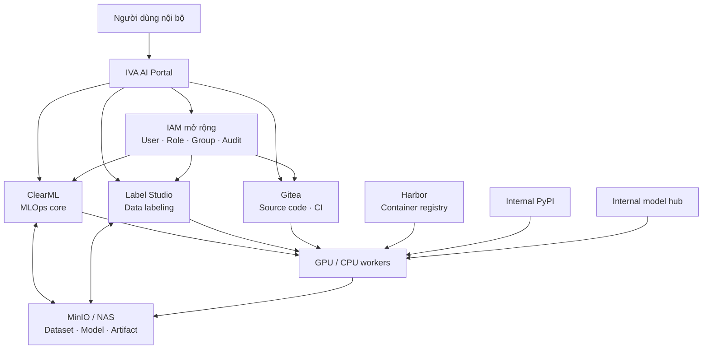
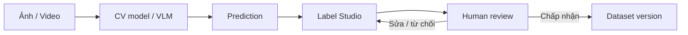
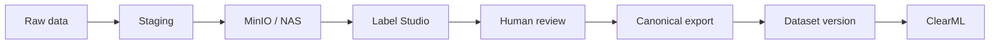
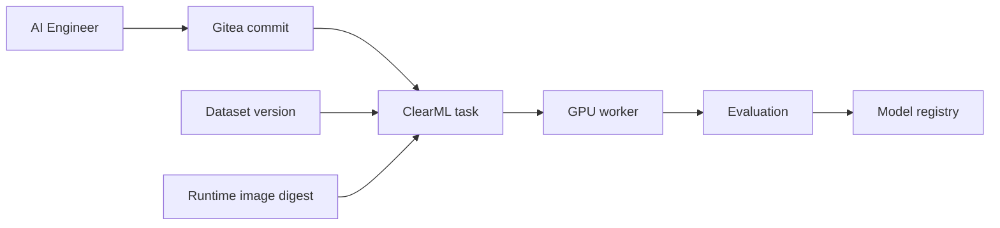
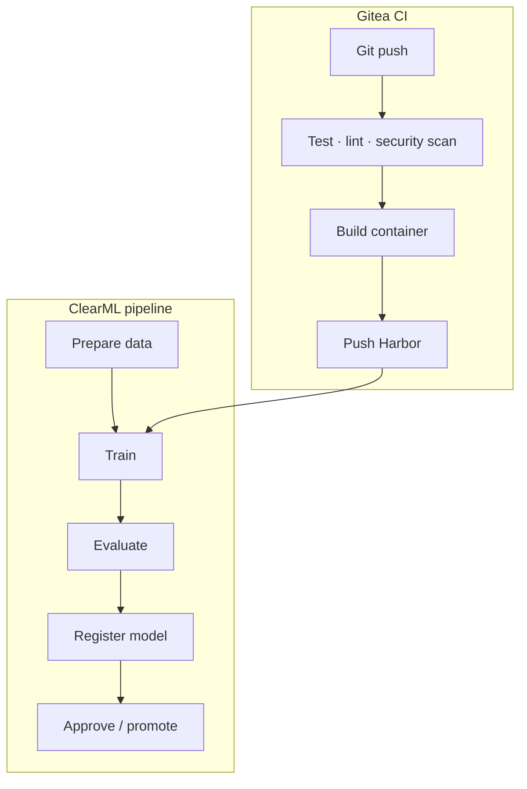
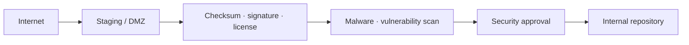

Một nền tảng AI nội bộ cần quản lý nhiều hơn các tác vụ huấn luyện. Dữ liệu thô phải được gán nhãn
và quản lý phiên bản; mỗi thử nghiệm phải gắn với đúng mã nguồn, môi trường chạy và bộ dữ liệu; mô
hình sau huấn luyện phải có thể truy ngược nguồn gốc. Khi hệ thống bị cô lập Internet, toàn bộ
container image, Python package và mô hình tiền huấn luyện cũng phải được cung cấp từ kho nội bộ.

Bài viết này đề xuất một kiến trúc tham chiếu cho IVA, trong đó [ClearML](https://clear.ml/docs/latest/docs/)
đóng vai trò lõi MLOps, [Label Studio](https://labelstud.io/guide/) phụ trách gán nhãn, Gitea quản lý
mã nguồn và CI, còn MinIO hoặc NAS lưu dữ liệu dung lượng lớn. Thiết kế ưu tiên khả năng tái lập,
truy xuất nguồn gốc và vận hành trong mạng air-gapped.

| Lớp | Thành phần chính | Trách nhiệm |
| --- | --- | --- |
| Truy cập | IVA AI Portal, IAM | Điểm vào thống nhất, xác thực và phân quyền |
| MLOps | ClearML Server, ClearML Agent | Thử nghiệm, pipeline, hàng đợi, dataset và model registry |
| Dữ liệu | Label Studio, MinIO/NAS | Gán nhãn, duyệt nhãn, lưu dataset và artifact |
| Phát triển | Gitea, CI | Mã nguồn, code review, build và kiểm thử |
| Chuỗi cung ứng | Harbor, internal PyPI, internal model hub | Cung cấp dependency đã được kiểm duyệt |
| Tính toán | GPU/CPU worker | Huấn luyện, đánh giá và suy luận |

## 1. Mục tiêu và nguyên tắc thiết kế

Kiến trúc cần đáp ứng các mục tiêu sau:

- quản lý dữ liệu và các phiên bản dataset;
- hỗ trợ gán nhãn thủ công, pre-label và auto-label cho ảnh hoặc video;
- theo dõi thử nghiệm, metric, log và artifact;
- quản lý phiên bản mô hình và trạng thái phát hành;
- liên kết mô hình với dataset, thử nghiệm, mã nguồn và môi trường chạy;
- chạy workload huấn luyện và suy luận trên GPU server nội bộ;
- quản lý tài khoản, vai trò và nhật ký kiểm toán;
- vận hành khi không có kết nối Internet.

Bốn nguyên tắc xuyên suốt là:

1. **Metadata và payload được tách rời.** ClearML quản lý metadata và lineage; object storage hoặc
   NAS lưu dữ liệu lớn.
2. **Mọi kết quả đều truy ngược được.** Một model version phải dẫn về đúng experiment, dataset,
   Git commit và runtime image.
3. **Human review là publication gate.** Nhãn do mô hình sinh ra chỉ trở thành dữ liệu huấn luyện
   sau khi qua bước kiểm tra phù hợp.
4. **Không tải dependency trực tiếp từ Internet.** Worker chỉ sử dụng artifact đã qua kiểm duyệt và
   được mirror vào mạng nội bộ.

## 2. Kiến trúc tổng thể



| Element | Mô tả ngắn |
| --- | --- |
| **Người dùng nội bộ** | AI Engineer, Data Engineer, annotator, reviewer, MLOps Engineer và quản trị viên sử dụng nền tảng. |
| **IVA AI Portal** | Điểm truy cập thống nhất, điều hướng người dùng đến các dịch vụ theo quyền được cấp. |
| **IAM mở rộng** | Quản lý danh tính, tài khoản, vai trò, nhóm, phiên đăng nhập và audit log. |
| **ClearML** | Lõi MLOps quản lý experiment, pipeline, queue, dataset version, artifact và model registry. |
| **Label Studio** | Không gian gán nhãn, pre-label, hiệu chỉnh dự đoán và human review. |
| **Gitea** | Git server nội bộ cho mã nguồn, pull request, code review và CI. |
| **MinIO / NAS** | Lưu dataset, annotation export, model weight, checkpoint và artifact dung lượng lớn. |
| **Harbor** | Kho container image nội bộ đã được build, quét và phê duyệt. |
| **Internal PyPI** | Kho Python package nội bộ cung cấp dependency đã được kiểm duyệt cho worker. |
| **Internal model hub** | Lưu model tiền huấn luyện, tokenizer, config, checksum và thông tin giấy phép. |
| **GPU / CPU workers** | Thực thi tác vụ tiền xử lý, huấn luyện, đánh giá, suy luận và auto-label. |

IVA AI Portal chỉ là lớp điều hướng và tích hợp. Nó không thay thế giao diện chuyên biệt của từng
hệ thống. ClearML Web vẫn là nơi chính để AI Engineer và MLOps Engineer theo dõi thử nghiệm,
pipeline, model và tài nguyên thực thi.

## 3. Trách nhiệm của từng thành phần

### 3.1. ClearML: lõi MLOps

[ClearML Server](https://clear.ml/docs/latest/docs/deploying_clearml/clearml_server/) cung cấp Web UI,
API server và file server để theo dõi, so sánh và quản lý task. Trong kiến trúc này, ClearML chịu
trách nhiệm cho:

- project và experiment/task;
- tham số, metric, log và artifact;
- quản lý phiên bản dataset;
- model registry và model lineage;
- pipeline, queue và điều phối ClearML Agent;
- thông tin mã nguồn như repository, branch và commit SHA;
- môi trường thực thi và output model.

ClearML Data có thể quản lý và liên kết các phiên bản dataset với task, trong khi payload được đặt
trên storage do tổ chức lựa chọn. Cách tách này phù hợp với dataset lớn và tránh đưa dữ liệu nhị phân
vào Git.

### 3.2. IAM mở rộng

ClearML OSS hỗ trợ cấu hình đăng nhập cho server tự host, nhưng vòng đời tài khoản, nhóm người dùng,
audit log và chính sách truy cập chi tiết thường cần thêm một lớp IAM của tổ chức. Lớp mở rộng đề
xuất gồm:

- tạo, sửa, kích hoạt và vô hiệu hóa tài khoản;
- đặt lại hoặc thay đổi mật khẩu;
- ánh xạ người dùng vào role và group;
- ghi audit log cho thao tác quản trị;
- cấp và thu hồi phiên đăng nhập hoặc API credential;
- đồng bộ danh tính với các dịch vụ trong portal.

MVP có thể bắt đầu với hai vai trò `ADMIN` và `USER`. Phân quyền theo project, dataset, model, queue
và experiment được triển khai ở giai đoạn sau. Cần lưu ý rằng
[Access Rules theo tài nguyên](https://www.clear.ml/docs/latest/docs/webapp/settings/webapp_settings_access_rules/)
và user group nâng cao là tính năng ClearML Enterprise; nếu chỉ dùng OSS, đội ngũ phải tự xây dựng
hoặc tích hợp cơ chế tương đương và đánh giá kỹ ranh giới ủy quyền.

### 3.3. Label Studio: gán nhãn và human review

Label Studio quản lý project gán nhãn cho các bài toán như:

- phân loại;
- object detection;
- segmentation;
- annotation văn bản hoặc metadata;
- rà soát và hiệu chỉnh dự đoán từ mô hình.

[ML backend của Label Studio](https://labelstud.io/guide/ml) cho phép kết nối model nội bộ để tạo
pre-annotation hoặc hỗ trợ gán nhãn tương tác. Backend có thể bọc YOLO, SAM, Grounding DINO, VLM
hoặc model riêng của IVA, miễn là đầu ra tuân theo cấu hình nhãn của project.



Prediction không nên được coi là ground truth. Bản ghi dataset cần lưu cả phiên bản model tạo nhãn,
confidence, người duyệt và thời điểm duyệt để hỗ trợ audit và phân tích chất lượng.

### 3.4. Gitea: mã nguồn và CI

Gitea là Git server nội bộ, dùng cho repository, branch, pull request, code review, tag, release và
CI. Pipeline CI nên kiểm thử mã nguồn, build container image và đẩy image đã ký hoặc đã quét vào
Harbor. ClearML chỉ ghi nhận tham chiếu bất biến tới Git commit và runtime image; nó không thay thế
quy trình quản lý mã nguồn.

### 3.5. MinIO hoặc NAS: data plane

MinIO hoặc NAS lưu payload dung lượng lớn:

```text
raw media
annotation export
dataset snapshot
model weights
checkpoint
training artifact
evaluation result
```

Object key không nên là định danh duy nhất của dữ liệu. Manifest dataset cần lưu checksum, kích
thước, media type và logical path; model hoặc experiment phải tham chiếu tới một dataset version bất
biến. Với MinIO, nên bật versioning, lifecycle policy và mã hóa phù hợp với chính sách nội bộ.

### 3.6. Kho artifact nội bộ

Worker không truy cập trực tiếp Internet. Ba kho nội bộ tạo thành supply chain cho workload:

- **Harbor** lưu base image, image huấn luyện, image suy luận và image auto-label;
- **internal PyPI** mirror các Python package đã được phê duyệt;
- **internal model hub** lưu pretrained weight, tokenizer, config và giấy phép đi kèm.

Image và model nên được tham chiếu bằng digest hoặc checksum thay vì tag có thể bị ghi đè. Việc này
giúp một experiment cũ có thể dùng lại đúng môi trường đã chạy trước đó.

## 4. Vòng đời dữ liệu



Quy trình đề xuất:

1. Dữ liệu thô được nạp vào vùng staging và kiểm tra định dạng, checksum, malware cùng metadata tối
   thiểu.
2. Dữ liệu hợp lệ được chuyển vào object storage; Label Studio chỉ nhận URL hoặc reference có thời
   hạn phù hợp.
3. Model nội bộ sinh pre-annotation. Annotator sửa và gửi nhãn; reviewer quyết định chấp nhận.
4. Hệ thống export annotation về một định dạng canonical, tạo manifest và khóa dataset version.
5. Dataset version được đăng ký trong ClearML để các task huấn luyện tham chiếu chính xác.

Không nên ghi đè một dataset đã dùng để huấn luyện. Mọi thay đổi về dữ liệu, nhãn hoặc cách chia
train/validation/test đều tạo phiên bản mới.

## 5. Vòng đời thử nghiệm và mô hình



Mỗi experiment phải ghi tối thiểu:

| Nhóm | Metadata bắt buộc |
| --- | --- |
| Mã nguồn | Repository, branch/tag và commit SHA |
| Dữ liệu | Dataset ID, version và manifest checksum |
| Môi trường | Container image digest, package lock và hardware profile |
| Huấn luyện | Hyperparameter, seed, log, metric và checkpoint |
| Đánh giá | Evaluation dataset, metric definition và kết quả |
| Đầu ra | Model ID, weight checksum, config và artifact URI |

Model chỉ được đưa vào registry sau khi bước đánh giá thành công. Việc **register** không đồng nghĩa
với **deploy**: một model còn phải qua chính sách phê duyệt, kiểm tra bảo mật, kiểm tra giấy phép và
promotion trước khi phục vụ production.

### Ví dụ lineage

```text
Model       vehicle_detector:v27
Experiment  IVA-VEHICLE-00042
Dataset     vehicle:v12
Git commit  81a72fa
Runtime     harbor.iva.local/iva/pytorch@sha256:...
Metric      mAP50 = 0.91
```

Từ `vehicle_detector:v27`, hệ thống phải truy ngược được toàn bộ chuỗi trên. Chiều ngược lại cũng
quan trọng: khi phát hiện lỗi trong `vehicle:v12`, đội ngũ phải tìm được mọi experiment và model đã
sử dụng phiên bản đó.

## 6. Tách CI khỏi ML pipeline

CI và ML pipeline phục vụ hai vòng đời khác nhau:



Gitea CI xác nhận tính đúng đắn và an toàn của mã nguồn cùng runtime image. ClearML pipeline điều
phối dữ liệu, tính toán, đánh giá và model registry. Tách hai luồng giúp tránh build môi trường tùy
ý ngay trong job huấn luyện và làm rõ trách nhiệm khi một run thất bại.

## 7. Cách tác vụ chạy trên GPU/CPU

ClearML Agent chạy trên các node GPU hoặc CPU và lấy task từ queue:

```text
ClearML Server → Queue → ClearML Agent → Container → GPU/CPU
```

Nên tách queue theo loại workload và mức độ tin cậy, chẳng hạn:

- `training-gpu` cho huấn luyện dài hạn;
- `evaluation-gpu` cho benchmark có thể tái lập;
- `auto-label-gpu` cho inference từ Label Studio;
- `utility-cpu` cho tiền xử lý và export.

Mỗi worker chỉ được phép đọc các project, bucket và registry cần thiết. Job chạy trong container với
filesystem tạm thời, resource limit và credential ngắn hạn; không gắn credential quản trị vào image.

## 8. Vận hành trong mạng air-gapped

Các endpoint nội bộ có thể được tổ chức như sau:

```text
ai.iva.local       IVA AI Portal
clearml.iva.local  ClearML Web/API
label.iva.local    Label Studio
git.iva.local      Gitea
minio.iva.local    Object storage
harbor.iva.local   Container registry
pypi.iva.local     Python package index
models.iva.local   Internal model hub
```

Worker chỉ được truy cập các endpoint cần thiết trong danh sách cho phép. DNS, TLS certificate,
thời gian hệ thống, secret rotation và log aggregation cũng phải hoạt động hoàn toàn trong mạng nội
bộ; nếu thiếu một trong các dịch vụ nền này, hệ thống air-gapped vẫn có thể thất bại dù application
đã được mirror đầy đủ.

### Quy trình nhập artifact



Quy trình này áp dụng cho container image, Python hoặc OS package, pretrained model, tokenizer,
model config và source archive. Hồ sơ nhập cần lưu nguồn, phiên bản, checksum, giấy phép, kết quả
quét và người phê duyệt. Không nên mirror mù toàn bộ upstream repository.

## 9. Giao diện người dùng

Portal nội bộ tại `https://ai.iva.local` cung cấp điểm vào thống nhất:

```text
IVA AI Platform
├── MLOps             → ClearML
├── Data labeling     → Label Studio
├── Source code       → Gitea
├── Container images  → Harbor
└── Documentation     → Runbook và policy nội bộ
```

Để tránh tạo thêm một lớp authorization khó kiểm soát, portal nên ưu tiên SSO và deep link. Chỉ xây
API tổng hợp khi thực sự cần một workflow xuyên hệ thống, ví dụ tạo đồng thời project ClearML,
Label Studio, bucket và repository theo một template đã phê duyệt.

## 10. Phạm vi MVP

MVP nên chứng minh một lát cắt end-to-end duy nhất:

```text
Raw images → Auto-label → Human review → Dataset v1
           → ClearML experiment → GPU training → Evaluation → Model registry
```

Tiêu chí hoàn thành gồm:

- người dùng đăng nhập bằng tài khoản nội bộ và chỉ thấy tài nguyên được phép;
- Label Studio đọc được media từ storage và gọi được một ML backend nội bộ;
- nhãn đã duyệt tạo được dataset version bất biến;
- task ClearML chạy trên GPU worker mà không cần Internet;
- model trong registry truy ngược được dataset, Git commit, runtime image và metric;
- artifact ngoài mạng đi qua quy trình staging và kiểm duyệt;
- backup và restore được kiểm thử cho metadata lẫn object storage.

MVP không cần high availability hoặc autoscaling hoàn chỉnh, nhưng không nên bỏ qua audit log,
backup và checksum vì rất khó bổ sung lineage đáng tin cậy sau khi dữ liệu đã phát sinh.

## 11. Topology triển khai đề xuất

```text
IVA INTERNAL NETWORK
│
├── Access
│   ├── IVA AI Portal
│   ├── Identity Provider / IAM Extension
│   └── Reverse Proxy / TLS
│
├── MLOps
│   ├── ClearML Web
│   ├── ClearML API Server
│   ├── ClearML File Server
│   └── ClearML metadata services
│
├── Data and Development
│   ├── Label Studio
│   ├── Gitea
│   └── MinIO / NAS
│
├── Artifact Supply Chain
│   ├── Harbor
│   ├── Internal PyPI
│   └── Internal Model Hub
│
└── Compute
    ├── GPU Worker 01
    ├── GPU Worker 02
    └── CPU Worker
```

Ở production, metadata database, object storage và secret store phải có kế hoạch backup độc lập.
Monitoring cần bao phủ queue latency, dung lượng storage, GPU utilization, tỷ lệ job thất bại,
thời gian auto-label và độ trễ từ annotation đến dataset publication.

## Kết luận

Kiến trúc này phân chia trách nhiệm rõ ràng: ClearML quản lý vòng đời MLOps, Label Studio quản lý
annotation, Gitea quản lý mã nguồn và CI, MinIO/NAS lưu payload, còn Harbor, PyPI và model hub nội
bộ bảo vệ chuỗi cung ứng. Điểm quan trọng nhất không nằm ở số lượng công cụ mà ở hợp đồng giữa
chúng: định danh bất biến, metadata lineage đầy đủ, publication gate rõ ràng và quyền truy cập tối
thiểu.

Một PoC nên bắt đầu bằng một workflow hẹp nhưng chạy trọn vẹn. Khi chuỗi từ dữ liệu thô đến model
registry đã tái lập được trong điều kiện không có Internet, hệ thống mới nên mở rộng sang high
availability, phân quyền chi tiết, model deployment và production governance.

## Tài liệu tham khảo

- [ClearML Server](https://clear.ml/docs/latest/docs/deploying_clearml/clearml_server/)
- [ClearML Data](https://www.clear.ml/docs/latest/docs/clearml_data/)
- [ClearML Model Registry](https://clear.ml/docs/latest/docs/model_registry/)
- [Cấu hình ClearML Server tự host](https://clear.ml/docs/latest/docs/deploying_clearml/clearml_server_config/)
- [ClearML Access Rules](https://www.clear.ml/docs/latest/docs/webapp/settings/webapp_settings_access_rules/)
- [Label Studio: tích hợp ML backend](https://labelstud.io/guide/ml)
- [Label Studio: import pre-annotation](https://labelstud.io/guide/predictions)
